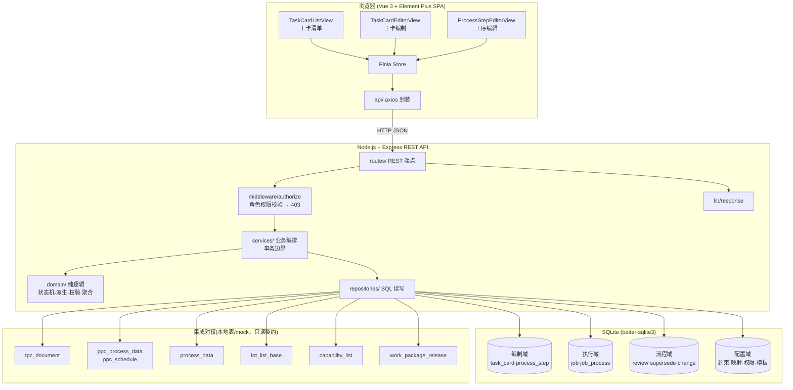
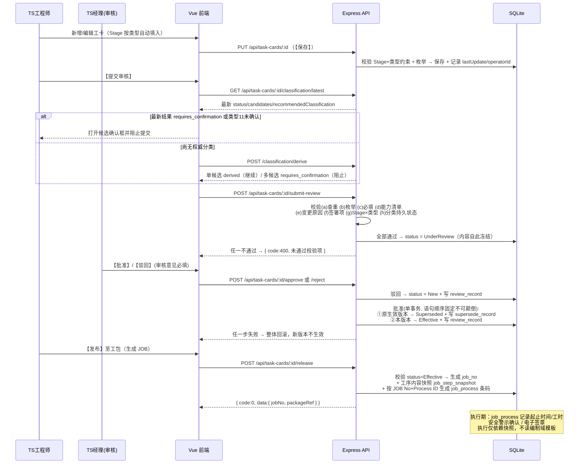

# 设计文档：工卡管理（Task Card Management）

## Overview

本设计文档描述 HAECO LGS MES 工程模块中**工卡管理（Task Card Management，流程编号 LGS-TS-01-01）** 在全新独立项目 `HAECO-MES-TS` 中的实现方案，覆盖 requirements.md 全部 **49 条需求**。

三大界面：

1. **工卡清单界面（Task Card List）** — 工卡统一查询、筛选、批量操作与状态管理入口。
2. **工卡编制界面（Task Card Editor）** — 工卡结构化元数据编制与管理主界面，满足工作指令最小信息集（I.1–I.11）。
3. **工序信息编辑界面（Process Step Editor）** — 工卡执行步骤的可视化编辑与数据采集配置界面，支持 13 类功能组件插入。

### 技术定位与设计原则

本项目是 `HAECO-MES-TS` 目录下的**全新独立全栈应用**，与相邻的 `HAECO-Demo`（纯手写、零构建的浏览器演示）互相独立。`HAECO-Demo` **仅作为前端 UI / 组件外观的参考**，本设计**不**继承其 browser-only / 零构建约束。

核心设计原则（**优先把功能跑起来，保持尽可能简单**）：

- **简单优先**：以"能快速运行、易于维护"为首要目标，避免过度设计。
- **轻量全栈**：单一 Express REST API 服务 + SQLite 单文件数据库 + Vue 3 前端。
- **无重型 ORM**：使用 `better-sqlite3` 轻量同步驱动，直接写 SQL 或极薄查询辅助函数。
- **统一响应契约**：所有 REST 接口返回 `{ code, message, data }` 信封。
- **纯逻辑隔离**：业务规则集中于 `server/src/domain/*` 纯函数，无 I/O，便于属性测试。
- **配置驱动 Hotfix**：所有待业务方澄清项（见《临时设计说明》）一律以配置表 + 默认数据实现，澄清后改数据不改代码。

### 技术栈（Technology Stack）

| 层 | 技术选型 | 说明 |
|----|----------|------|
| 前端 Frontend | Vue 3 + Vue Router 4 + Pinia + Element Plus + Vite | SPA |
| HTTP 客户端 | axios | 薄封装，统一解析 `{ code, message, data }` |
| 后端 Backend | Node.js + Express | 单一 REST API 服务 |
| 数据库 Database | SQLite（`better-sqlite3`） | 单文件 `data/haeco-mes-ts.db`，同步驱动 |
| 数据访问 | 原生 SQL + 轻量 helper | 避免重型 ORM |
| 测试 Testing | Vitest + fast-check（属性测试）+ Supertest（接口测试） | JS 生态一致 |

### 项目目录结构

```
HAECO-MES-TS/
├── server/
│   ├── src/
│   │   ├── app.js                    # Express 装配（中间件、路由挂载、错误处理）
│   │   ├── index.js                  # 启动入口
│   │   ├── db/
│   │   │   ├── connection.js         # better-sqlite3 连接单例
│   │   │   ├── schema.sql            # 建表 DDL
│   │   │   ├── migrate.js            # 建表/迁移脚本
│   │   │   └── seed.js               # 枚举、配置默认数据与演示数据
│   │   ├── domain/                   # 纯业务逻辑（无 I/O，属性测试主要对象）
│   │   │   ├── enums.js              # 枚举集合与封闭性校验
│   │   │   ├── card-rules.js         # 状态机、升版、复制、查重、打印投影、BOM 条件、可编辑态、发布前置
│   │   │   ├── supersede.js          # 版本取代与单一生效版本保障
│   │   │   ├── relation.js           # 工卡关联建立、自动关联与关键信息同步
│   │   │   ├── snapshot.js           # 释放时工序内容快照与执行域隔离
│   │   │   ├── review.js             # 提交审核校验清单、批准/驳回
│   │   │   ├── batch-replace.js      # 批量替换管控（态限制/原因/留痕/幂等）
│   │   │   ├── task-no.js            # 单张与批量编号生成（前缀/后缀/序列）
│   │   │   ├── process-id.js         # 工序编号生成规则
│   │   │   ├── barcode.js            # JOB 工序条码生成（JOB No + Process ID）
│   │   │   ├── filter.js             # 清单筛选（AND 语义）
│   │   │   ├── classification.js     # 商务分类优先级链派生
│   │   │   ├── stage-constraint.js   # Stage × 工卡类型强约束校验
│   │   │   ├── capability.js         # 能力清单范围校验
│   │   │   ├── permission.js         # 角色权限边界判定
│   │   │   ├── signature.js          # 签署项聚合与无纸化归档判定
│   │   │   ├── safety.js             # 关键工序安全警示门禁
│   │   │   ├── times.js              # JOB 工卡/工序起止时间聚合与时序校验
│   │   │   ├── bom.js                # BOM Base 输出汇总（IR 卡 + Lot List）
│   │   │   ├── print-template.js     # 打印模板选用
│   │   │   ├── void-rules.js         # 作废前置校验
│   │   │   ├── migrate-card.js       # 文字格式工卡迁移与逐条校验
│   │   │   ├── change-record.js      # 变更留痕构造（全部编辑入口共用单点）
│   │   │   ├── exec-doc.js           # 执行过程单据（含 SWS）复制
│   │   │   └── export-fields.js      # 关键/全量导出字段划分
│   │   ├── repositories/             # SQL 读写封装
│   │   ├── services/                 # 组合 domain + repository（事务边界）
│   │   ├── routes/                   # Express 路由（REST 端点）
│   │   ├── middleware/
│   │   │   ├── user-context.js       # 解析当前用户（app_user）并挂载 req.user
│   │   │   └── authorize.js          # 角色权限校验中间件（越权 → 403 + 写 access_denial_log）
│   │   ├── storage/                  # 附件本地存储（data/attachments），提供落盘与取回
│   │   └── lib/response.js           # { code, message, data } 信封辅助
│   └── package.json
├── web/
│   ├── src/
│   │   ├── main.js
│   │   ├── router/
│   │   ├── stores/
│   │   ├── api/                      # axios 封装 + 资源 API 模块
│   │   ├── views/task-card/          # 三大界面
│   │   └── components/               # 复用组件
│   └── package.json
├── data/haeco-mes-ts.db              # SQLite 数据文件（运行时生成）
└── data/attachments/                 # 附件（图片/视频/音频）落盘目录（运行时生成）
```

### 设计边界（同步 requirements.md「模块边界声明」）

- **工卡管理（LGS-TS-01-01）** — 本模块范围。
- **工作范围管理（Work Scope）** — 独立功能，本模块仅经需求 25.3 描述对接触点（依 PID/ISO 提供可选工卡范围）。
- **工包清单数据库及单 PID 工包生成（LGS-TS-01-03）** — 独立流程，本模块仅描述对接触点（需求 24 发布、需求 37 JOB No 承载、需求 48 BOM Base 输出、需求 42.1(c) 在编工包引用查询）。
- **非例行工卡（NRC Control, LGS-TS-01-02）** — 独立流程，本模块仅描述对接触点（需求 21 工卡关联）。
- **补充工作单（SWS, LGS-TS-03-05）** — 归属待澄清（需求 23.3）。本模块仅提供其**复制**（需求 23.1、23.2）与**关联**（需求 21.3）能力，为此建最小 `exec_document` 实例表，**不提供 SWS 编制界面**。
- **Lot 检查/记录清单（Lot List, LGS-TS-03-04）** — 独立模块（《临时设计说明》A6 待澄清项 1）。本模块仅建立关联并**只读**其 Base Number 集合（需求 48.1–48.3）；上级件名称与 LRU 标记的维护界面归 Work Package List 模块（需求 48.7）。
- **技术出版物中心（TPC, LGS-TS-07-01）** — 独立流程，TPC 文件上传与版本维护不在本模块；本模块仅读取其文档元数据（需求 7.3、25.1）。
- **JOB 执行域** — 执行界面、多 SHEET 整合展示、执行附页等具体功能依蓝图归属生产蓝图。本模块声明 JOB No 生成触发点与承载关系（需求 37），并定义由编制域配置所决定的执行期契约：条码（需求 15）、起止时间（需求 33）、安全警示门禁（需求 31）、电子签章与归档（需求 32）、工序内容快照（需求 49.5–49.7）。此清单为本模块与生产蓝图的接口边界，生产蓝图不就同一行为重复定义。
- **集成系统**在当前阶段一律以**本地表 + mock 端点**表示，后续替换为真实对接。覆盖范围：TPC 数据库、工包系统（发布结果 + 在编工包引用查询）、PPC 数据（工作分类与预计工时）、**PPC 排产（JOB TARGET DATE 来源，需求 26.4）**、**Process Data（PART No/S/N/DES./Operation Type 与工序 Operation 来源，需求 27.2、30.1）**、**Lot List（LT 单据的 Base Number 集合来源，需求 48.3）**、能力清单，以及商务分类派生的四个外部判定源（计划端 Dummy Job 设置、NRC 发起单据、外包清单、工包划分分类）与零件性质（LLP）。上述判定源与数据源本属其它模块，本模块仅定义**读取契约**，不建业务主表（见 §1.9）。

### 本轮修订（与 requirements.md 49 条需求对齐）

本次修订不改变既有架构判断，仅补齐七处「需求有 SHALL、设计无落位对象」的缺口，并按属性反思原则合并而非新增冗余属性：

| 序 | 缺口 | 处置 | 需求 |
|----|------|------|------|
| 1 | Process Data 无读取契约（PART No/S/N/DES./Operation Type、工序 Operation 均标注「Process Data 带出」但无来源） | §1.9 新增 `GET /api/process-data`；新增 mock 表 `process_data` | 27.1–27.3, 30.1, 30.2 |
| 2 | JOB TARGET DATE 标注「依 PPC 排产带出」但无来源 | §1.9 新增 `GET /api/ppc/schedule`；新增 mock 表 `ppc_schedule` | 26.4 |
| 3 | Lot List 的 Base Number 集合无读取契约，`aggregateBomBase` 入参取不到值 | §1.9 新增 `GET /api/lot-lists/:lotListRef/bases`；新增 mock 表 `lot_list_base` | 48.3, 48.8 |
| 4 | `config_write` 权限点无任何对应端点，「改配置不改代码」无可操作入口 | §1.7 新增四组配置维护端点（约束表 / 类型映射 / 优先级链 / 能力清单） | 29.8, 43.5, 46.14, 47.9 |
| 5 | SWS 复制无落位实体（SW 仅为 `exec_doc_type` 的一个 code） | 新增最小 `exec_document` 表与 `POST /api/exec-documents/copy`；复制语义并入 Property 3 / 20 | 23.1–23.3 |
| 6 | 普通编辑/删除/升版/作废四条留痕路径无属性覆盖（此前仅批量替换路径经 Property 13 覆盖） | 新增 `domain/change-record.js` 与 **Property 35** | 19.1–19.3, 42.5 |
| 7 | 需求 45.7「打印时按签署项配置呈现签署栏」无追溯落位 | 扩展 `printProjection` 与 Property 8 | 45.7 |

同时扩展 Property 29 正文，纳入需求 26.5、27.3、30.2 的只读带出字段不可写断言（与 P29 既有的「TS 恒不可写 PPC 工时」同形，不另立属性）。属性总数由 34 增至 **35**。

## Architecture

### 分层架构

Vue 前端 → Express REST API → SQLite。后端内部区分路由层、权限中间件、服务层（事务边界）、领域逻辑层（纯函数）与仓储层。



### 编制 → 审核 → 生效 → 释放全流程时序



> **批准事务的语句顺序为强制约束**：`UNIQUE(task_no) WHERE status='Effective'` 是 SQLite 部分唯一索引，采用**语句级立即校验**（SQLite 不支持延迟约束）。若先将新版本置为 `Effective`、再降级原生效版本，则第一条 UPDATE 执行瞬间同一 `task_no` 下存在两个 `Effective`，索引立即报错并触发需求 44.8 的回滚，结果是任何版本都无法生效。因此批准服务 **SHALL** 按「①降级原生效版本 → Superseded；②置本版本为 Effective」的顺序执行，两步同处一个 `better-sqlite3` 事务。Property 25 相应断言的是**事务内每一中间步骤后**单一生效不变式均成立，而非仅断言最终态。

## Components and Interfaces

### 1. REST API 端点（server/src/routes）

统一前缀 `/api`，统一返回 `{ code, message, data }`（`code=0` 成功）。术语按需求 C2 拆分为 **【保存】/【提交审核】/【发布】** 三类动作，端点命名严格区分。

#### 1.1 工卡清单与查询

| 方法 & 路径 | 说明 | 需求 |
|-------------|------|------|
| `GET /api/task-cards` | 多维筛选查询（acType, taskNo, gearType, title, status, stage, cardType, page, pageSize），AND 组合 | 1.1–1.5, 2.1, 2.2, 4.4, 46.6 |
| `GET /api/task-cards/:id` | 工卡详情（含参考文件、工序、签署项、关联、变更记录）；`?jobNo=` 携带 JOB 上下文时附执行期字段 | 3.2, 3.5, 26.2, 26.3 |
| `GET /api/task-cards/:id/versions` | 某 Task No 各版本列表与状态 | 19.3, 38.7, 44.4 |
| `GET /api/task-cards/check-duplicate` | 查重（taskNo, revision, excludeId） | 10.5, 38.6 |

#### 1.2 编制与保存（【保存】）

| 方法 & 路径 | 说明 | 需求 |
|-------------|------|------|
| `POST /api/task-cards` | 新增（状态 New、FAI 默认否、Date 默认当天） | 3.1, 4.1, 7.2, 36.3 |
| `PUT /api/task-cards/:id` | 保存编制内容（校验 Stage×类型约束、枚举；记录 lastUpdate/operatorId） | 7.4, 10.3, 46.10, 46.11 |
| `POST /api/task-cards/:id/reference-docs` / `DELETE .../:docId` | 参考文件增删 | 9.1–9.3 |
| `POST /api/task-cards/:id/relations` / `DELETE .../:relId` / `GET .../relations` | 工卡关联增删查（全 11 类单据，落 `card_relation` 表） | 21.1–21.3 |
| `POST /api/task-cards/:id/relations/auto` | 执行期衍生单据（PC/CR/TS 等）产生时由服务层自动建立关联，标记 `origin='auto'` | 21.4 |
| `POST /api/task-cards/:id/relations/sync` | 关键信息（机型/件号/序列号/工卡编号）变更时同步至关联记录快照列 | 21.5 |
| `POST /api/attachments` / `GET /api/attachments/:id` / `DELETE /api/attachments/:id` | 附件（图片/视频/音频）上传、取回与删除；`multipart/form-data`，落 `data/attachments` + `attachment` 表，返回 `{id, url}` 供组件 `payload.url` 引用 | 13.2, 13.3, 18.1, 31.2, 5.3 |

#### 1.3 审核流程（【提交审核】/批准/驳回）

| 方法 & 路径 | 说明 | 需求 |
|-------------|------|------|
| `POST /api/task-cards/:id/submit-review` | 提交审核：执行完整校验清单 (a) 查重 (b) 枚举 (c) 必填 (d) 能力清单 (e) 变更原因 (f) 签署项 **(g) Stage×工卡类型组合 (h) 最新持久化商务分类须唯一派生或人工确认** 后置 UnderReview | 34.1, 34.2, 10.4, 10.5, 19.2, 29.4, 29.6, 39.2, 45.9, 46.10 |
| `POST /api/task-cards/:id/approve` | 批准（审核意见必填、一编一审、事务内触发版本取代） | 34.4, 34.6, 34.7, 22.3, 44.1, 44.2, 44.8 |
| `POST /api/task-cards/:id/reject` | 驳回（审核意见必填，状态回 New） | 34.5, 34.6, 34.7 |
| `GET /api/task-cards/:id/reviews` | 按版本查询审核记录 | 34.8, 34.9 |

#### 1.4 版本、复制与状态

| 方法 & 路径 | 说明 | 需求 |
|-------------|------|------|
| `POST /api/task-cards/copy` | 批量复制（body: ids, numbering{prefix,suffix,startSeq,step}）；按规则生成不重复 Task No | 3.3, 23.1, 38.1–38.3, 38.8–38.10 |
| `POST /api/task-cards/revise` | 批量升版（保持 Task No、版本+1、状态 New） | 3.4, 7.1, 38.4, 38.5 |
| `POST /api/task-cards/:id/void` | 作废（body: reason 必填；执行前置引用校验） | 4.3, 42.1, 42.2, 42.5 |
| `GET /api/task-cards/:id/void-precheck` | 作废前置校验预览（返回三类引用命中情况） | 42.1, 42.2 |
| `GET /api/task-cards/:id/change-records` | 变更记录查询 | 19.1, 19.3 |
| `POST /api/task-cards/batch-replace` | 批量替换（body: ids, field, from, to, reason 必填）；独立权限点 | 20.1–20.10 |
| `POST /api/exec-documents/copy` | **SWS（及其它执行过程单据）复制**：body `{ id, newDocNo }`，副本内容逐字段一致、`doc_no` 不重复、`status='New'`、`revision` 初始，沿用需求 38.1–38.3 规则 | 23.1, 23.2 |
| `GET /api/exec-documents` / `GET /api/exec-documents/:id` | 执行过程单据实例列表与详情（SWS 复制的取数与结果查看；**本模块不提供其编制界面**，见需求 23.3） | 23.2, 23.3 |

#### 1.5 工序、签署项与安全警示

| 方法 & 路径 | 说明 | 需求 |
|-------------|------|------|
| `POST /api/task-cards/:id/steps` | 新增工序（自动生成 Process ID；**不生成条码**） | 11.1, 15.3 |
| `PUT /api/task-cards/:id/steps/:stepId` | 保存工序（Skill/RefDoc/双语描述/采集项/组件） | 11.2, 12.1–12.3, 13.1–13.3, 18.1, 18.2 |
| `DELETE /api/task-cards/:id/steps/:stepId` | 删除工序 | 19.1 |
| `POST /api/task-cards/:id/steps/reorder` | 工序排序 | 10.1 |
| `PUT /api/task-cards/:id/steps/:stepId/safety` | 维护安全警示/视觉提示/维修技巧/关键标记 | 31.1–31.4 |
| `POST /api/task-cards/:id/steps/:stepId/signature-requirements` / `DELETE .../:reqId` | 签署项配置增删（角色/盖章/日期/顺序） | 45.1–45.5 |
| `GET /api/task-cards/:id/signature-requirements` | 工卡必需签署项集合（全工序并集） | 45.6, 32.4 |
| `GET /api/step-templates` / `POST /api/step-templates` / `POST .../steps/:stepId/apply-template` | 工序模板列出/保存/应用（对应需求 14 的单工序模板复用） | 14.1, 14.2 |
| `GET /api/task-cards/:id/steps/template-file` / `POST /api/task-cards/:id/steps/import` | 工序**批量**模板下载（Excel 空模板）与导入，对应需求 10.1 的「模板下载 / 模板导入」；复用迁移主通道的 Excel 解析与逐条校验管道 | 10.1 |

#### 1.6 发布、JOB 与执行期数据

| 方法 & 路径 | 说明 | 需求 |
|-------------|------|------|
| `POST /api/task-cards/:id/release` | 【发布】至工包：`canRelease` 校验 status=Effective → 单事务内生成 JOB No、`job_step_snapshot` 工序快照与 `job_process` 条码 | 24.1–24.3, 37.1–37.4, 15.1, 15.2, 49.5 |
| `GET /api/jobs/:jobNo` | JOB 详情（执行期字段 + 起止时间） | 26.3, 33.1, 37.2 |
| `GET /api/jobs/:jobNo/processes` | JOB 工序实例（含条码） | 15.1, 15.2, 15.4 |
| `POST /api/job-processes/:id/start` / `/finish` | 报工开始/完成（记录工序起止时间并聚合至工卡） | 33.3–33.6, 33.8 |
| `PUT /api/job-processes/:id/manhours` | 执行期有效/实际工时写入（Production 权限） | 11.4, 47.7 |
| `POST /api/job-processes/:id/safety-ack` | 安全警示查看确认（关键工序执行前置门禁） | 31.5–31.7 |
| `POST /api/task-cards/:id/signatures` | 电子签章签署（签署人/签章标识/完成日期） | 32.2, 32.3 |
| `GET /api/task-cards/:id/archive-status` | 无纸化归档完备性判定 | 32.1, 32.4 |

#### 1.7 商务分类、约束与配置

| 方法 & 路径 | 说明 | 需求 |
|-------------|------|------|
| `POST /api/task-cards/:id/classification/derive` | 评估启用的 P1–P6 并聚合全部候选，返回 `{resultId,status,classification,candidates,recommendedClassification}`；候选含首次层级与全部 `sources` | 29.1–29.5, 43.3–43.5 |
| `GET /api/task-cards/:id/classification/latest` | 读取最新持久化派生/确认结果，供编辑页按 `status` 恢复 pending | 29.7–29.9 |
| `GET /api/task-cards/:id/classification/history` | 按追加顺序读取完整派生/确认历史 | 29.7 |
| `POST /api/task-cards/:id/classification/confirm` | body `{derivationResultId,classification,outsourceSubtype?}`；校验最新结果与完整候选，Outsource subtype 必填 | 29.3, 29.6, 29.10 |
| `GET /api/stage-constraints` | Stage × 工卡类型允许组合与横切取值 | 46.9, 46.12, 46.13 |
| `PUT /api/stage-constraints` | **维护约束表与横切取值**（`config_write` 权限）：写 `stage_card_type_constraint` / `stage_crosscut`，改配置即改校验结果，不改代码 | 46.14 |
| `GET /api/card-type-commercial-map` / `PUT ...` | **维护工卡类型 → 商务分类映射**（P6 兜底层，`config_write` 权限） | 43.1, 43.2, 43.5 |
| `GET /api/derivation-priority` / `PUT ...` | **维护商务分类优先级链层级顺序**（`tier_order` / `enabled`，`config_write` 权限）；服务层一律按本表排序读取 | 29.2, 29.8 |
| `GET /api/capabilities` / `PUT /api/capabilities` | 能力清单（QA 维护）；写入需 `capability_write` 权限 | 39.1, 39.4, 47.8 |
| `GET /api/print-templates` / `PUT /api/print-templates/:id` | 按类型配置打印模板 | 40.1, 40.2 |
| `GET /api/system-parameters` | 系统参数（含组织名称） | 35.1, 35.2 |
| `GET /api/enums` | 全部枚举集合（含派生优先级、签署角色、角色） | 6.3–6.10, 16.1, 16.2, 45.2, 47.1 |
| `GET /api/me/permissions` | 当前用户权限点集合（前端按此禁用操作） | 47.1–47.9 |

#### 1.8 导出、打印、迁移与 BOM

| 方法 & 路径 | 说明 | 需求 |
|-------------|------|------|
| `GET /api/task-cards/export` | 导出（mode=key\|all, ids） | 3.6, 3.7 |
| `GET /api/task-cards/:id/print` | 按类型选模板生成打印模型（剔除 cardType，含工时与起止时间栏） | 5.1–5.3, 16.3, 33.9, 40.3–40.5 |
| `POST /api/migrations` | 批量迁移（Word/RTF/Excel/结构化文本），逐条校验、失败跳过 | 41.1–41.6, 17.1, 17.2 |
| `GET /api/migrations/:id/report` | 迁移结果报告（成功/失败条数与失败原因） | 41.4, 41.5 |
| `POST /api/task-cards/:id/lot-links` / `DELETE .../:linkId` | IR Lot 卡与 Lot List 关联增删 | 48.1, 48.2 |
| `GET /api/task-cards/:id/bom-bases` | BOM Base 输出（两来源并集，标识 source/lotNumber） | 48.3–48.6, 48.8 |

#### 1.9 集成数据（本地表 / mock）

| 方法 & 路径 | 说明 | 需求 |
|-------------|------|------|
| `GET /api/tpc/documents` | TPC 文档检索，回填四字段 | 7.3, 25.1 |
| `GET /api/ppc/process-data` | PPC 工作分类与预计工时（TS 只读；无写端点，写入归 PPC 专属界面，见需求 47.4） | 11.3, 25.2, 47.4, 47.5 |
| `GET /api/ppc/schedule` | **PPC 排产结果读取**（`?pid=&cardId=`），返回 `{ jobTargetDate }`，释放生成 JOB 时写入 `job.job_target_date`；取不到时该列留空，编制态本就不呈现该栏位 | 26.4 |
| `GET /api/process-data` | **Process Data 读取契约**（`?pid=&cardId=&stepId=`），一次返回 `{ partNo, partSn, partDesc, operationType, operation }`：前四项落 `job` 表（需求 27.5 要求存执行域），`operation` 供工序只读展示 | 27.1, 27.2, 30.1 |
| `GET /api/lot-lists/:lotListRef/bases` | **Lot List Base 集合读取契约**，返回 `[{ baseNumber, lotNumber }]`，为 `aggregateBomBase` 的 `lotLinks` 入参补齐 Base 值；Lot List（LT 单据）主数据归独立模块（《临时设计说明》A6），本模块只读 | 48.3, 48.8 |
| `GET /api/pid/:pid/scope` | 依 PID 机型/客户/工作范围与 ISO 提供可选工卡范围 | 25.3 |
| `GET /api/classification-sources` | **商务分类判定源聚合读取**（`?cardId=`），一次返回 P1–P5 全部输入：`{planDummyJob, nrcOriginatingDoc, outsourceEntry, partNature, packageDivision}`，即 `deriveCommercialClassification` 的 `sources` 入参 | 29.2 |
| `GET /api/work-packages/in-progress-refs` | **在编（尚未释放）工包中已选入某工卡的引用**（`?cardId=`），供作废前置校验第三类引用判定 | 42.1(c), 42.2 |

#### 1.10 用户上下文（最小身份方案）

需求 22.3 一编一审、需求 7.4 `operator_id`、需求 47 权限体系均依赖「当前用户是谁」。当前阶段不引入完整认证体系，采用**最小可闭环方案**：

| 方法 & 路径 | 说明 | 需求 |
|-------------|------|------|
| `POST /api/session` | 以 `staffNo` 选定当前操作身份，校验其存在于 `app_user` 后签发不透明 token（存内存 Map），后续请求经 `Authorization: Bearer <token>` 携带 | 22.3, 7.4, 47.1 |
| `DELETE /api/session` | 释放当前身份 | — |
| `GET /api/me` | 返回当前用户 `{staffNo, name, role}` | 47.1 |
| `GET /api/me/permissions` | 当前用户权限点集合（前端按此禁用操作） | 47.1–47.9 |
| `GET /api/access-denials` | 越权尝试审计查询（承接需求 47.10 的记录要求） | 47.10 |

`middleware/user-context.js` 解析 token 并挂载 `req.user`；缺失或无效时返回 `401`。**本方案为演示阶段替代品，不含口令、会话过期与加密传输**，替换为企业统一认证时仅需改写该中间件与 `POST /api/session`，下游服务层与领域函数不受影响。

> 未选中工卡的批量操作由前端在 `selectedRows` 为空时拦截提示"请先选择工卡"（需求 3.8）；后端对空 `ids[]` 亦返回 `code=400` 兜底。

### 2. 后端领域逻辑（server/src/domain，纯函数）

| 模块 | 关键函数 | 职责 | 需求 |
|------|----------|------|------|
| `enums.js` | `ENUMS`、`isValidEnumValue(field, value)` | 枚举集合与封闭性校验；Ctrl Code 与 Skill 为独立值域不合并 | 6.3–6.10, 16.1, 16.2 |
| `card-rules.js` | `canTransition(from, to)` | 状态迁移合法性，依 `ALLOWED_TRANSITIONS`（五态） | 4.5–4.7, 34 |
| `card-rules.js` | `nextRevision(card)` | 升版：返回**默认**版本号（原版本+1），Task No 不变；调用方允许以手动指定值覆盖，覆盖后须经 `checkDuplicate` 校验 (Task No, Revision) 唯一性 | 3.4, 7.1, 7.5, 38.4, 38.5 |
| `card-rules.js` | `isEditable(card)` | 编制域内容可编辑态判定：`status === "New"`；其余四态一律冻结 | 49.1–49.4, 34.3, 44.4 |
| `card-rules.js` | `canRelease(card)` | 发布前置：`status === "Effective"` | 24.1, 24.2 |
| `card-rules.js` | `copyCard(card, newTaskNo)` | 复制：内容一致、状态 New、版本初始 | 3.3, 23.1, 38.1–38.3 |
| `card-rules.js` | `checkDuplicate(cards, taskNo, revision, excludeId)` | 同版本内 Task No 查重 | 10.5, 38.6 |
| `card-rules.js` | `printProjection(card, template, jobContext?)` | 打印投影：剔除 cardType，含最小信息集与工时/起止时间栏；**并按每道工序的 `signature_requirement` 配置逐工序输出签署栏（签署人/签章/完成日期栏位）** | 5.2, 5.3, 16.3, 33.9, 45.7 |
| `card-rules.js` | `requiresBomFields(card)` | IR 卡（cardType='04'）BOM 字段条件 | 8.1–8.3 |
| `supersede.js` | `supersedeOnApprove(cards, approvedCard)` | 新版本生效时原生效版本 → Superseded，产出取代记录；保证单一生效 | 44.1, 44.2, 44.7, 38.7 |
| `supersede.js` | `isFrozen(card)` | 内容冻结判定 = `!isEditable(card)`，即 UnderReview / Effective / Superseded / Void 四态**均**冻结（原仅覆盖 Superseded/Void，按需求 49.1 扩展） | 4.7, 34.3, 44.4, 44.5, 49.1, 49.2 |
| `relation.js` | `buildRelation(card, doc, origin)` | 建立关联记录，`origin ∈ {manual, auto}`；执行期衍生单据走 auto | 21.1, 21.3, 21.4 |
| `relation.js` | `syncRelationKeyInfo(relation, keyInfo)` | 关键信息（机型/件号/序列号/工卡编号）变更同步至关联记录快照列 | 21.5 |
| `relation.js` | `requiredSignDocTypes(relations, signRuleCfg)` | 从关联单据中取出签署要求属性为「签署」的类型集合，供 submit-review 校验项 (f) | 16.4, 45.8, 45.9 |
| `snapshot.js` | `buildStepSnapshots(steps, captureItems, components, sigReqs)` | 释放时生成工序内容快照（不可变），JOB 执行仅依赖快照 | 49.5–49.7, 37.5 |
| `review.js` | `submitReviewChecklist(card, ctx)` | 提交审核完整校验清单 (a) 查重 (b) 枚举 (c) 必填 (d) 能力清单 (e) 变更原因 (f) 签署项 (g) Stage×类型 (h) 最新持久化商务分类唯一派生或人工确认，返回未通过项 | 29.4, 29.6, 34.1, 34.2, 46.10 |
| `review.js` | `canApprove(card, userId)` | 一编一审：审核人 ≠ 编制人 | 22.3 |
| `review.js` | `acceptReviewAction(card, action, comment)` | 批准/驳回接受条件（态=审核中 且 意见非空） | 34.4–34.7, 34.10 |
| `batch-replace.js` | `batchReplace(cards, spec, reason)` | 批量替换：仅 New 态、原因必填、逐卡留痕、幂等、整批回滚语义 | 20.1–20.10 |
| `task-no.js` | `generateTaskNoBatch(rule, existing, count)` | 批量编号生成，跳过占用序号 | 38.8–38.10 |
| `process-id.js` | `generateProcessId(card, seq)` | 工序编号（A–Z 后接 AA、AB…，见 D-02） | 11.1 |
| `barcode.js` | `generateBarcode(jobNo, processId)` | JOB 工序条码（`{JOB No}-{Process ID}`，见 D-03）；编制态不生成 | 15.1–15.4 |
| `filter.js` | `matchesFilters(card, filters)` | 清单 AND 筛选（空条件全通过） | 1.2–1.5, 4.4 |
| `classification.js` | `deriveCommercialClassification(card, sources, priorityCfg)` | 按已裁定 P1→P6 顺序评估并聚合全部命中：同分类合并全部 `sources`，首个候选为推荐；单候选 `derived`，多候选 `requires_confirmation`；类型 11 忽略 P1–P5、固定双候选且推荐为 null | 29.1–29.5, 43.3–43.5 |
| `classification.js` | `confirmClassification(derivation, choice, ctx)` | 仅接受当前 `derivationResultId` 对应的完整候选；Outsource 必须回传候选内 subtype，确认后保留所选证据并标记确认人/时间 | 29.6, 29.10 |
| `stage-constraint.js` | `validateStageCardType(stage, cardType, cfg)` | Stage × 类型强约束校验（允许组合 ∪ 横切取值） | 46.9–46.11, 46.13 |
| `stage-constraint.js` | `defaultStageFor(cardType, cfg)`、`selectableStages(cardType, cfg)` | 单一允许 Stage 时给出**默认值**（不置只读），并返回可改选范围 = 该类型允许组合 ∪ 横切取值（需求 46.12 修正后） | 46.12, 46.13 |
| `stage-constraint.js` | `selectableForStandardPackage(card)` | 组包取卡谓词：`stage === "RTN" && status === "Effective"`；`stage === "WFD"` 恒排除。本函数为本模块向 Work Package List 模块暴露的**契约谓词**，取卡查询由 WPL 模块实现 | 46.3, 46.5, 42.4, 44.5 |
| `capability.js` | `checkCapability(card, capabilityList)` | （机型, 起落架, Skill）∈ 能力清单 | 39.2–39.4 |
| `permission.js` | `checkPermission(role, permissionPoint, cfg)` | 角色权限边界判定 | 47.1–47.10 |
| `signature.js` | `aggregateSignatureRequirements(steps)` | 必需签署项 = 全工序签署项并集 | 45.6, 45.8, 45.9 |
| `signature.js` | `canArchivePaperless(card, requirements, signatures)` | 无纸化归档完备性 | 32.2–32.4 |
| `safety.js` | `canEnterExecution(step, acks, userId)` | 关键工序安全警示前置门禁 | 31.5–31.7 |
| `times.js` | `computeCardTimes(processTimes)`、`isChronological(start, finish)` | 工卡起止时间聚合与时序校验 | 33.5, 33.6, 33.8 |
| `bom.js` | `aggregateBomBase(cards, lotLinks)` | BOM Base 两来源并集，标识 source/lotNumber | 48.3–48.6, 48.8 |
| `print-template.js` | `selectPrintTemplate(card, templates)` | 按类型选模板，无专属回退默认 | 40.3, 40.4 |
| `void-rules.js` | `checkVoidPrecondition(card, refs, reason)` | 作废前置校验（三类引用 + 原因非空） | 42.1, 42.2, 42.5 |
| `migrate-card.js` | `migrateRecords(rows)` | 逐条校验、失败跳过并记原因、产出报告；保留原命名 | 41.3–41.6, 17.1, 17.2 |
| `export-fields.js` | `exportFields(mode)` | 关键/全量导出字段划分（见 D-05） | 3.6, 3.7 |
| `change-record.js` | `buildChangeRecords(before, after, changeType, reason, operatorId)` | **变更留痕构造（纯函数）**：比对变更前后逐字段差异，产出 `change_record` 行集合（含 field/oldValue/newValue/reason/operator/timestamp）；`reason` 为空（含纯空白）整体拒绝。全部编辑入口（保存、删除、升版、批量替换、作废）共用此单点，保证需求 19.1 的留痕不因入口不同而缺失 | 19.1, 19.2, 19.3, 20.8, 42.5 |
| `exec-doc.js` | `copyExecDocument(doc, newDocNo)` | **执行过程单据（含 SWS/SW）复制**：内容逐字段一致、`doc_no` 取不重复新值、`status='New'`、`revision` 初始，与 `copyCard` 同语义 | 23.1, 23.2, 38.1–38.3 |

### 3. 前端页面与组件（web/src）

| 页面 View | 路由 | 说明 | 需求 |
|-----------|------|------|------|
| `TaskCardListView` | `/task-card/list` | 筛选（含 Stage/状态五值）、列布局、批量操作、打印、批量替换、作废 | 1–5, 20, 36.4, 42, 46.6 |
| `TaskCardEditorView` | `/task-card/editor` | Tab：基础信息 / 参考文件 / 工序 / 关联工卡 / 审核记录；支持 add/edit/view/revise 模式；**仅 `status === 'New'` 可编辑**，其余四态整体转为只读并提示「变更请先升版」（前端为体验层拦截，后端 `isEditable` 为权威闸门） | 6–10, 19, 21, 26–29, 34, 35, 36, 43, 49 |
| `ProcessStepEditorView` | `/task-card/step` | 工序属性、双语描述、采集项、13 类组件插入、签署项、安全警示 | 11–15, 18, 30, 31, 45 |
| `JobViewerView` | `/job/:jobNo` | JOB 上下文查看：执行期字段、起止时间、条码、签署、安全警示确认 | 15, 26.3, 31.5–31.7, 32, 33, 37 |

关键前端组件：

| 组件 | 用途 | 需求 |
|------|------|------|
| `SearchToolbar` | 清单筛选（A/C Type、Task No、Gear Type、标题、状态、Stage） | 1.1, 4.4, 46.6 |
| `TaskCardTable` | 列表展示 FAI/Gear Type/模板类型/工卡类型/编号/标题/五值状态；WFD 显著标识 | 2.1, 2.2, 46.6 |
| `ColumnSettingsDialog` | 列显示/顺序配置，持久化 `haeco_tc_list_columns` | 2.3, 2.4 |
| `MetadataForm` | 元数据录入；Stage 按类型带出**默认值且可改选**（可选范围 = 该类型允许组合 ∪ 横切取值 {DMY,NRC,WCC,WFD}，不置只读）；IR 卡条件显示 BOM 字段；组织名称只读；整表在 `status !== 'New'` 时整体禁用 | 6, 7, 8, 28, 35, 36, 46.12, 46.13, 49.1 |
| `AttachmentUploader` | 图片/视频/音频上传（调 `POST /api/attachments`），返回 `{id,url}` 写入组件 `payload.url` | 13.2, 13.3, 31.2, 18.1 |
| `ReferenceDocTable` | 参考文件增删（类型/参考号/版本/ATA） | 9.1–9.3 |
| `ProcessStepList` | 工序入口（新增插件/模板下载/模板导入/排序/全选/折叠展开）；〔待澄清〕蓝图原文仅「模板下载/导入」四字，当前按「工序批量 Excel 模板」实现，若业务方所指为单工序模板则归并至需求 14 | 10.1 |
| `ComponentInserter` | **13 类**组件插入面板（含签署栏） | 13.1–13.3, 18.1 |
| `SignatureRequirementPanel` | 工序级签署项配置（角色/盖章/日期/顺序） | 45.1–45.5 |
| `SafetyWarningEditor` | 安全警示/视觉提示（图片·视频）/维修技巧编辑与关键标记 | 31.1–31.4 |
| `SafetyAckDialog` | 执行前强制查看确认弹窗；未确认禁用进入执行 | 31.5, 31.6 |
| `ClassificationConfirmDialog` | 优先使用传入/最新 pending，必要时 derive；展示全部候选、推荐（类型 11/推荐 null 隐藏）、首次层级及全部 sources；以含分类/subtype/来源的稳定 key 渲染，保留完整候选对象并携带 `derivationResultId` 确认 | 29.3–29.10 |
| `ReviewPanel` | 提交审核/批准/驳回，审核意见必填；pending/类型 11 未确认时体验层阻止，单候选自动派生可继续；展示并响应后端 (h) 分类门禁 | 34 |
| `TpcLookupDialog` | TPC 文档检索选择，回填四字段 | 7.3, 25.1 |
| `BatchReplaceDialog` | 批量替换（原因必填、态限制提示、结果逐条反馈） | 20 |
| `BatchCopyDialog` | 批量复制编号规则（前缀/后缀/起始序号/步长）与事后调整 | 38.8–38.10 |
| `ExecDocCopyDialog` | SWS（SW 单据）复制：选取来源单据、指定不重复新编号、结果反馈；不含单据编制表单（需求 23.3） | 23.1, 23.2 |
| `CardRelationPanel` | 关联全 11 类执行单据 | 21 |
| `LotLinkPanel` | IR Lot 卡与 Lot List 关联 | 48.1, 48.2 |
| `BomBaseTable` | BOM Base 输出展示（标识来源与 Lot Number） | 48.3–48.6 |
| `BarcodeView` | JOB 工序条码/二维码展示 | 15.1, 15.2 |
| `ElectronicSignaturePanel` | 电子签章签署与归档状态 | 32 |
| `MigrationImportDialog` | 迁移导入（Word/RTF/Excel）与结果报告展示 | 41 |
| `VoidDialog` | 作废（原因必填 + 前置校验结果展示） | 42 |

### 4. 前端 API 层（web/src/api）

axios 拦截器：`code===0` 返回 `data`，否则抛出携带 `message` 的错误；`401` 跳身份选择，`403` 统一提示越权。资源模块：`taskCardApi`、`reviewApi`、`stepApi`、`jobApi`、`classificationApi`、`configApi`（含约束表 / 类型映射 / 优先级链 / 能力清单的读写）、`execDocApi`（SWS 复制与查询）、`migrationApi`、`bomApi`、`integrationApi`（TPC / PPC / PPC 排产 / Process Data / Lot List / PID scope），方法与 §1 端点一一对应。

## Data Models

SQLite 单文件 `data/haeco-mes-ts.db`。列名 `snake_case`，API 出入参转 `camelCase`。

### 统一响应信封

```jsonc
{
  "code": 0,        // 0 成功；400 校验失败 / 401 未识别身份 / 403 越权 / 404 未找到 / 409 重复 / 422 前置条件非法 / 500 异常
  "message": "ok",  // 人类可读消息（中文）
  "data": {}        // 业务数据；错误时可为 null
}
```

**`code` 与 HTTP status 的关系（约定）**：非零 `code` 恒**镜像**为同值 HTTP status（`code:403` ⇒ HTTP 403）；`code:0` 恒对应 HTTP 200。据此前端 axios 拦截器可只依据 HTTP status 做统一分支（如 401 跳身份选择、403 统一越权提示），业务分支再读 `code` 与 `message`。业务上「部分失败但整批成功」的场景（迁移逐条失败、商务分类待人工确认）一律用 `code:0` + `data` 内的明细承载，不占用错误码。

**枚举的单一事实来源（Single Source of Truth）**：`server/src/domain/enums.js` 为唯一权威定义，SQLite `CHECK` 约束由 `db/schema.sql` 生成时从 `enums.js` 取值渲染，禁止在两处各自手写。凡属《临时设计说明》待澄清项的枚举（`SIGNATURE_ROLE` / A3、`STAGE_CROSSCUT` / A4、`DERIVATION_PRIORITY` / A1）一律**同时**落配置表并以配置表为运行时权威，`enums.js` 仅提供种子默认值——以符合「Hotfix 一律配置驱动」原则，避免澄清后触发 schema 迁移。

### 枚举与配置常量

```javascript
// 机型 A/C Type（需求 6.3）
const AC_TYPE = ["190","195","320","32E","330","350","737","73C","741","744",
                 "747","748","757","767","777","787","909","919","999","A21"];

// 起落架类型 Gear Type（需求 6.4）
const GEAR_TYPE = ["BLG","LDG","MLG","N/A","NLG","WLG"];

// 阶段 Stage（需求 6.5）
const STAGE = ["CUS","DMY","MOD","NRC","RTN","SPC","WCC","WFD"];

// 专业 Skill（需求 6.6）
const SKILL = ["AS","BH","CL","DI","EL","GR","IR","LA","LT","ML",
               "NC","NT","PL","PP","PPC","QC","SC","SP","TS","TSC"];

// 控制代码 Ctrl Code（需求 6.7）
// ⚠ 待业务方确认（临时设计说明 前序遗留 2）：蓝图描述列错位。
// 需求 6.10：Ctrl Code 与 Skill 为相互独立值域，同码不同义，不合并、不共用字典。
const CTRL_CODE = ["AS","CL","DA","FAB","FT","IS","LD","MD","OHV"];

// 工卡类型编码 01–11（需求 16.1）。注：需求 6.8 明确 WBS 与工卡类型为同一字段的两种称法，
// 系统内仅以 task_card.card_type 单列存储，前端 WBS 下拉即绑定该列。
const CARD_TYPE = {
  "01": "收货检查工卡 / Receiving inspection card",
  "02": "拆分卡 / Disassembly card",
  "03": "预处理卡 / Pre-treatment card",
  "04": "IR卡 / IR Inspection card",
  "05": "IR Lot卡 / Lot card",
  "06": "组装/测试卡 / Assembly card",
  "07": "电线卡 / Electrical card",
  "08": "LRU Subcontract卡 / LRU Subcontract card",
  "09": "单独件维修卡 / Individual repair card",
  "10": "AD/SB/SL卡 / AD/SB/SL card",
  "11": "客户特殊要求卡 / Customer special card"
};

// 执行过程单据类型（需求 16.2）与签署要求属性（需求 16.4、16.5）
const EXEC_DOC_TYPE = ["CR","PC","LT","BH","TS","SC","NR","PR","EN","SW","TA"];
const EXEC_DOC_SIGN_RULE = {
  "CR": "签署", "PC": "签署", "LT": "签署", "BH": "签署", "TS": "签署",
  "SC": "单据不签署，所发工卡步骤需签署",
  "NR": "签署", "PR": "签署", "EN": "签署", "SW": "签署", "TA": "签署"
};

// 工卡状态（需求 4、34、44）
const CARD_STATUS = ["New","UnderReview","Effective","Superseded","Void"];
// 新增 / 审核中 / 生效 / 已被取代 / 作废

// 允许的状态迁移（需求 4.5–4.7）
const ALLOWED_TRANSITIONS = {
  "New":         ["UnderReview","Void"],   // 提交审核 / 作废
  "UnderReview": ["Effective","New"],      // 批准 / 驳回
  "Effective":   ["Superseded","Void"],    // 被更高版本取代(系统自动) / 作废
  "Superseded":  [],                       // 终态
  "Void":        []                        // 终态
};

// 组件插入类型（需求 13.1）：前 12 类为蓝图明列，signature 承载 I.8
const COMPONENT_TYPE = ["measurement","table","text","tool","image","video",
                        "audio","range","consumable","time","dataGroup","custom",
                        "signature"];

// 签署角色（需求 45.2）⚠ Hotfix 假定（临时设计说明 A3）
const SIGNATURE_ROLE = ["Operator","QC","NDT","CertifyingStaff"];

// 商务执行工卡分类（需求 29.1）与外包二级细分（需求 29.3）
const COMMERCIAL_CLASSIFICATION = ["Gear Inspection","Routine","Material Special Replacement",
                        "SB/AD/SL","NRC","LLP","Configuration(MOD)","Outsource","Dummy Job"];
const OUTSOURCE_SUBTYPE = ["L sub","工序外委"];

// 商务分类派生优先级链（需求 29.2，业务方 2026-08-10 已裁定）
const DERIVATION_PRIORITY = [
  "P1_PlanSetting",      // Dummy Job
  "P2_OriginatingDoc",   // NRC
  "P3_OutsourceList",    // Outsource (L sub / 工序外委)
  "P4_PartNature",       // LLP
  "P5_PackageDivision",  // Routine / Material Special Replacement / Configuration(MOD)
  "P6_CardTypeFallback"  // 依 card_type_commercial_map 兜底，永不覆盖 P1–P5
];

// 系统角色（需求 47.1）
const ROLE = ["TS_Engineer","TS_Manager","NDT_Reviewer",
              "Planning_Engineer","Planning_Manager",
              "Production_Technician","Production_Manager","QA_Engineer"];

// 权限点值域（需求 47.2–47.9）——role_permission.permission_point 的封闭取值集
// 无此词表则需求 47 与 Property 29 无法确定性实现与测试
const PERMISSION_POINT = [
  "card_read",            // 清单查询与详情查看（TS/Planning/Production/QA 均可）
  "card_edit",            // 新增 / 编辑 / 复制 / 升版（TS_Engineer）
  "card_submit_review",   // 提交审核（TS_Engineer）
  "card_review",          // 批准 / 驳回（TS_Manager，受一编一审约束）
  "card_void",            // 作废（TS_Manager）
  "card_release",         // 发布至工包（TS_Engineer）
  "card_print_export",    // 打印与导出
  "batch_replace",        // 批量替换（独立权限点，需求 20.9、47.9，不由 card_edit 继承）
  "migration_run",        // 存量迁移执行
  "ppc_manhours_write",   // 工序 Work Category / Estimated ManHours 写入（Planning_*）
  "job_exec_write",       // JOB 执行数据写入（Production_*）
  "capability_write",     // 能力清单维护（QA_Engineer）
  "config_write"          // 约束表 / 映射 / 优先级链 / 打印模板等配置维护
];

// 横切 Stage 取值（需求 46.13）⚠ Hotfix 假定（临时设计说明 A4）
// 不受工卡类型约束，可与任意类型共存；需求 46.12 修正后 Stage 不置只读，故本集合对全部类型可达
const STAGE_CROSSCUT = ["DMY","NRC","WCC","WFD"];
```

### 编制域表

#### 表：task_card（工卡）

| 列 | 类型 | 键/约束 | 说明 | 需求 |
|----|------|---------|------|------|
| `id` | INTEGER | PK AUTOINCREMENT | 系统内唯一 ID | — |
| `task_no` | TEXT | NOT NULL | 工卡编号 | 6.1, 6.2 |
| `revision` | INTEGER | NOT NULL DEFAULT 1 | 版本号（初始 1，见 D-01 格式化） | 6.1, 7.1, 38.5 |
| `title` | TEXT | NOT NULL | 标题 | 6.1 |
| `date` | TEXT | | 修订日期 YYYY-MM-DD，默认当天 | 6.1, 7.2 |
| `ac_type` | TEXT | CHECK ∈ AC_TYPE | 机型 | 6.3, 6.9 |
| `gear_type` | TEXT | CHECK ∈ GEAR_TYPE | 起落架类型 | 6.4, 6.9 |
| `stage` | TEXT | CHECK ∈ STAGE | 阶段（受 card_type 强约束） | 6.5, 6.9, 46 |
| `skill` | TEXT | CHECK ∈ SKILL | 专业 | 6.6, 6.9 |
| `ctrl_code` | TEXT | CHECK ∈ CTRL_CODE | 控制代码（与 Skill 独立值域） | 6.7, 6.9, 6.10 |
| `card_type` | TEXT | NOT NULL CHECK ∈ CARD_TYPE keys | **工卡类型（= WBS，单列存储，见需求 6.8）** | 6.8, 16.1, 16.3, 8 |
| `is_fai` | INTEGER | NOT NULL DEFAULT 0 | 是否 FAI（默认否） | 2.1, 36.1, 36.3 |
| `template_type` | TEXT | | 模板类型 | 2.1, 36.2 |
| `status` | TEXT | NOT NULL CHECK ∈ CARD_STATUS | 工卡状态（五值） | 4, 34, 44 |
| `document_type` / `ref_no` / `document_revision` / `document_desc` | TEXT | | TPC 带出（只读） | 7.3, 25.1 |
| `base_number` | TEXT | | IR 卡基础件号（card_type='04'） | 8.1, 8.3 |
| `ipc_item_no` | TEXT | | IR 卡 IPC 项号 | 8.2, 8.3 |
| `created_by` | TEXT | | 编制人（一编一审依据） | 22.1, 22.3, 28.1 |
| `reviewed_by` | TEXT | | 最近审核人 | 22.2, 34.4 |
| `ndt_reviewer` | TEXT | | NDT 审核人（角色字段，非独立审核节点） | 28.2 |
| `ata_chapter` | TEXT | | ATA 章节号 | 28.3 |
| `check_type` | TEXT | | 检查类型 | 28.4 |
| `commercial_classification` | TEXT | CHECK ∈ COMMERCIAL_CLASSIFICATION | **当前商务分类（权威当前值，见下方权威源说明）** | 29.1 |
| `outsource_subtype` | TEXT | CHECK ∈ OUTSOURCE_SUBTYPE | 外包二级细分（仅 Outsource） | 29.3 |
| `last_update` | TEXT | | 最后更新日期（保存自动记录） | 7.4 |
| `operator_id` | TEXT | | 操作人工号（保存自动记录） | 7.4 |
| `naming_rule_origin` | TEXT | | 迁移工卡保留的原命名 | 17.1, 41.6 |

索引与约束：
- `UNIQUE(task_no, revision)` — 工卡唯一性（需求 38.6）。
- 部分唯一索引 `UNIQUE(task_no) WHERE status='Effective'` — 保障同编号最多一个生效版本（需求 38.7、44.7）。**注意其立即校验特性对批准语句顺序的约束**，见 Architecture 节批准事务说明。

> **`revision` 的存储与展示口径**：数据库与 API 出入参一律为 **INTEGER**（初始 `1`）；两位补零（`01`、`02`…）仅为 **UI 展示与打印输出**的格式化，由前端与 `printProjection` 单点处理。《临时设计说明》D-01 中「采用两位数字补零字符串」的表述以本节为准修正为「整数存储 + 两位补零展示」，避免导出与打印处出现 `1` 与 `01` 混用、以及 `UNIQUE(task_no, revision)` 比较语义歧义。
>
> **执行域起止时间不在 task_card**：工卡级 Start Time / Finish Time 已按需求 33.1、33.7 落于 `job` 表。原设计在 `task_card` 上另设 `start_time` / `finish_time` 两列与需求 37.5「JOB 执行数据的产生不修改来源 Task Card」及 Property 31 直接冲突（执行期报工会写编制域行），且同一工卡多次释放时取值无解，故**移除**。

> **已移除 `wbs` 列**：需求 6.8 明确 WBS 与工卡类型为同一字段的两种称法，仅以 `card_type` 单列存储；前端 WBS 下拉直接绑定 `card_type`，需求 8 的 IR 卡判断以 `card_type='04'` 为准。
>
> **执行期字段不在 task_card**：OWNER / JOB TARGET DATE / Check / 进厂·出厂 P/N·S/N / CSNo. / WORK ORDER 及 Process Card 字段（PART No/S/N/DES./Operation Type）均属执行域，存于 `job` 表（需求 26.2 要求编制态不呈现空壳栏位，需求 37.5 要求两域分离）。
>
> **商务分类权威源与 pending 语义**：`task_card.commercial_classification` / `outsource_subtype` 为**当前权威值**（供审核、筛选与下游使用）；`commercial_classification_result` 为追加式状态与证据轨迹。只有最新结果为 `derived` 或 `confirmed` 时服务层才同步权威值；`requires_confirmation` / `undetermined` 只追加轨迹，**不得清空既有权威值**。前端以轨迹最新行的 `status` 恢复 pending，不以 `card_type='11'` 或权威值是否为空猜测。

#### 表：reference_document（参考文件，需求 9）

| 列 | 类型 | 键/约束 | 说明 |
|----|------|---------|------|
| `id` | INTEGER | PK | |
| `card_id` | INTEGER | FK → task_card(id) ON DELETE CASCADE | 所属工卡 |
| `doc_type` | TEXT | | 文件类型 |
| `ref_no` | TEXT | | 参考号 |
| `doc_revision` | TEXT | | 版本号 |
| `ata_chapter` | TEXT | | ATA 章节号 |

#### 表：process_step（工序，编制域模板）

| 列 | 类型 | 键/约束 | 说明 | 需求 |
|----|------|---------|------|------|
| `id` | INTEGER | PK | | |
| `card_id` | INTEGER | FK → task_card(id) ON DELETE CASCADE | 所属工卡 | |
| `process_id` | TEXT | NOT NULL | 自动生成工序编号（见 D-02） | 11.1 |
| `seq` | INTEGER | | 排序序号 | 10.1 |
| `skill` | TEXT | CHECK ∈ SKILL | 技能要求（手动维护；与卡头 `skill` 同值域，口径一致） | 11.2, 6.6 |
| `ref_doc_id` | INTEGER | FK → reference_document(id) | 参考文件（引用本卡已登记的参考文件，替代自由文本以与需求 9 的结构化登记保持同一口径） | 11.2, 9.1 |
| `operation` | TEXT | | Operation（Process Data 带出，只读） | 30.1, 30.2 |
| `work_category` | TEXT | | 工作分类（PPC 写入，TS 只读） | 11.3, 25.2, 47.4 |
| `estimated_man_hours` | REAL | | 预计工时（PPC 写入，TS 只读） | 11.3, 25.2, 47.4 |
| `description_zh` | TEXT | | 中文步骤描述 | 12.1 |
| `description_en` | TEXT | | 英文步骤描述 | 12.1 |
| `safety_warning` | TEXT | | 安全警示内容 | 31.1 |
| `visual_cue` | TEXT (JSON) | | 视觉提示（图片/视频引用） | 31.2 |
| `repair_tips` | TEXT | | 维修技巧内容 | 31.3 |
| `is_critical` | INTEGER | 0/1 | 关键维修/易误操作标记 | 31.4 |

约束：`UNIQUE(card_id, process_id)`。

> **本表不含条码列**：按需求 15.3，条码属执行域，于工卡释放生成 JOB 时按 `JOB No + Process ID` 生成，存于 `job_process`，避免同一工卡多次维修复用同一条码。
>
> **本表不含工时执行值与起止时间**：有效/实际工时与工序起止时间属执行域，存于 `job_process`（需求 11.4、33.2–33.4、37.5）。

#### 表：capture_item（数据采集项，需求 12.2、12.3）

| 列 | 类型 | 键/约束 | 说明 |
|----|------|---------|------|
| `id` | INTEGER | PK | |
| `step_id` | INTEGER | FK → process_step(id) ON DELETE CASCADE | 所属工序 |
| `type` | TEXT | NOT NULL CHECK ∈ COMPONENT_TYPE | **采集项类型，与需求 13.1 的插入组件体系共用同一类型定义**（需求 12.2「共用类型定义」）；P/N、S/N 为 `text` 类型的常用实例而非固定两项 |
| `item_key` | TEXT | | 采集键（如 `PN`、`SN` 或自定义） |
| `label` | TEXT | | 显示标签 |
| `config` | TEXT (JSON) | | 类型特定配置，约定同 `inserted_component.payload`（如 `measurement`→`{unit,nominal}`） |
| `required` | INTEGER | 0/1 | 必填标记 |
| `sort_order` | INTEGER | | 顺序 |

#### 表：inserted_component（插入组件，需求 13、18）

| 列 | 类型 | 键/约束 | 说明 |
|----|------|---------|------|
| `id` | INTEGER | PK | |
| `step_id` | INTEGER | FK → process_step(id) ON DELETE CASCADE | 所属工序 |
| `type` | TEXT | CHECK ∈ COMPONENT_TYPE | 组件类型（13 类） |
| `payload` | TEXT (JSON) | | 类型特定数据 |
| `sort_order` | INTEGER | | 组件顺序 |

`payload` 约定：`measurement`→`{label,unit,nominal}`；`range`→`{label,unit,min,max}`；`table`→`{columns,rows}`；`text`→`{html}`；`tool`→`{toolPn,toolDesc,qty}`；`consumable`→`{materialNo,desc,qty,unit}`；`image`→`{attachmentId,url,annotations}`；`video`/`audio`→`{attachmentId,url,duration}`；`time`→`{label,format}`；`dataGroup`→`{label,items}`；`custom`→`{schema}`；`signature`→`{requirementId}`（引用 `signature_requirement`）。

#### 表：attachment（附件，需求 13.2、13.3、18、31.2、5.3）

图片 / 视频 / 音频不内联于 `payload`，统一经 `POST /api/attachments` 上传落盘后以 `attachmentId` 引用。

| 列 | 类型 | 键/约束 | 说明 |
|----|------|---------|------|
| `id` | INTEGER | PK | |
| `kind` | TEXT | CHECK ∈ ('image','video','audio') | 附件类别 |
| `original_name` | TEXT | | 上传时原始文件名（仅记录，不用于路径拼接） |
| `stored_path` | TEXT | NOT NULL | 相对 `data/attachments` 的存储路径，文件名由服务端生成 UUID + 扩展名 |
| `mime_type` | TEXT | NOT NULL | 校验白名单：image/(png\|jpeg\|webp)、video/mp4、audio/(mpeg\|wav) |
| `byte_size` | INTEGER | NOT NULL | 大小上限：image 10MB、audio 20MB、video 100MB，超限返回 `400` |
| `sha256` | TEXT | | 内容摘要，用于去重与完整性核对 |
| `uploaded_by` / `uploaded_at` | TEXT | | 上传人与时间 |

存储约定：文件名一律由服务端生成，**不采用**客户端原始文件名参与路径拼接（避免路径穿越）；`GET /api/attachments/:id` 经 `id` 查表后由服务端读取 `stored_path` 返回流，不暴露文件系统路径。当前为本地磁盘方案，后续替换为对象存储时仅改 `server/src/storage`。

#### 表：signature_requirement（工序级签署项，需求 45）

| 列 | 类型 | 键/约束 | 说明 |
|----|------|---------|------|
| `id` | INTEGER | PK | |
| `step_id` | INTEGER | FK → process_step(id) ON DELETE CASCADE | 所属工序 |
| `signature_role` | TEXT | CHECK ∈ SIGNATURE_ROLE | 签署角色（⚠ Hotfix 假定） |
| `stamp_required` | INTEGER | 0/1 | 是否需盖章 |
| `date_required` | INTEGER | 0/1 DEFAULT 1 | 是否记录完成日期 |
| `sort_order` | INTEGER | | 展示顺序（未强制签署时序，见 A3 待澄清） |

> 工卡下全部工序 `signature_requirement` 的并集即需求 32.4「必需签署项」的**唯一来源**。

#### 表：card_relation（工卡关联，需求 21）

承载 Task Card 与全部 11 类执行过程单据的关联关系。本表同时是需求 45.8/45.9「工卡涉及哪些需签署单据」的判定依据——`exec_doc_type` 经 `exec_doc_type.sign_rule` 即可得出该工卡是否存在要求签署的单据。

| 列 | 类型 | 键/约束 | 说明 | 需求 |
|----|------|---------|------|------|
| `id` | INTEGER | PK | | |
| `card_id` | INTEGER | FK → task_card(id) ON DELETE CASCADE | 来源 Task Card | 21.1 |
| `exec_doc_type` | TEXT | NOT NULL CHECK ∈ EXEC_DOC_TYPE | 关联单据类型（CR/PC/LT/BH/TS/SC/NR/PR/EN/SW/TA） | 21.3, 45.8 |
| `related_doc_no` | TEXT | NOT NULL | 关联单据编号 |  21.1 |
| `job_id` | INTEGER | FK → job(id) NULL | 执行期衍生单据所属 JOB；编制期人工关联为 NULL | 21.4 |
| `origin` | TEXT | CHECK ∈ ('manual','auto') | `auto` = 执行期产生 PC/CR/TS 等单据时由服务层自动建立（需求 21.4，无需人工关联） | 21.1, 21.4 |
| `key_info_snapshot` | TEXT (JSON) | | 关键信息快照 `{acType, partNo, serialNo, taskNo}`；由 `syncRelationKeyInfo` 在来源变更时同步刷新 | 21.5 |
| `created_by` / `created_at` | TEXT | | 建立人与时间 | 21.1 |

约束：`UNIQUE(card_id, exec_doc_type, related_doc_no)`。

#### 表：exec_document（执行过程单据实例，需求 23）

需求 23 要求复制 SWS，而 SWS 按需求 23.2 是执行过程单据类型 `SW` 的**实例**——`exec_doc_type` 只是类型字典，无法承载实例，`card_relation` 只承载「关联到哪个单据编号」而不含单据内容，故复制无落位对象。本表为**最小实例存储**：仅支撑需求 23.1/23.2 的复制与需求 21 的关联取数，**不含编制界面**（需求 23.3 明确该归属待澄清）。

| 列 | 类型 | 键/约束 | 说明 | 需求 |
|----|------|---------|------|------|
| `id` | INTEGER | PK | | |
| `exec_doc_type` | TEXT | NOT NULL CHECK ∈ EXEC_DOC_TYPE | 单据类型（SWS 即 `SW`） | 16.2, 23.2 |
| `doc_no` | TEXT | NOT NULL | 单据编号 | 23.1, 38.1 |
| `revision` | INTEGER | NOT NULL DEFAULT 1 | 版本号（复制置初始值） | 38.3 |
| `status` | TEXT | NOT NULL CHECK ∈ CARD_STATUS | 单据状态（复制置 `New`） | 38.3 |
| `title` | TEXT | | 单据标题 | 23.1 |
| `content` | TEXT (JSON) | | 单据内容全量（复制时逐字段克隆；结构随归属模块定案后细化） | 23.1 |
| `source_card_id` | INTEGER | FK → task_card(id) NULL | 来源工卡（若由工卡发出） | 21.1 |
| `created_by` / `created_at` | TEXT | | 建立人与时间 | — |

约束：`UNIQUE(exec_doc_type, doc_no, revision)`。

> **设计决策与待确认项**：本表刻意保持最小——`content` 为 JSON 而非展开列，因单据字段集随「SWS 编制归属哪个模块」的裁定而变（需求 23.3）。若裁定 SWS 编制归本模块，则将 `content` 展开为结构化列并补编制端点；若归 LGS-TS-03-05 独立流程，则本表退化为该模块的只读投影。建议登记为《临时设计说明》附录开发期待确认项 **D-07**。

#### 表：lot_list_link（IR Lot 卡与 Lot List 关联，需求 48.1、48.2）

| 列 | 类型 | 键/约束 | 说明 |
|----|------|---------|------|
| `id` | INTEGER | PK | |
| `card_id` | INTEGER | FK → task_card(id) ON DELETE CASCADE | 所属工卡（card_type='05'） |
| `lot_number` | TEXT | NOT NULL | Lot Number |
| `lot_list_ref` | TEXT | | Lot List（LT 单据）引用标识 |

#### 表：bom_base_output（BOM Base 输出，需求 48.3–48.8）

| 列 | 类型 | 键/约束 | 说明 |
|----|------|---------|------|
| `id` | INTEGER | PK | |
| `card_id` | INTEGER | FK → task_card(id) ON DELETE CASCADE | 来源工卡 |
| `base_number` | TEXT | NOT NULL | Base Number |
| `source` | TEXT | CHECK ∈ ('ir_card','lot_list') | 来源类型 |
| `lot_number` | TEXT | NULL | 来源为 lot_list 时携带 |
| `upper_part_name` | TEXT | NULL | 上级件名称（维护界面归属 WPL 模块，见 A6） |
| `is_lru` | INTEGER | 0/1 | LRU 标记 |

### 执行域表（需求 37 / 15 / 26 / 33）

#### 表：job（执行实例）

| 列 | 类型 | 键/约束 | 说明 | 需求 |
|----|------|---------|------|------|
| `id` | INTEGER | PK | | |
| `job_no` | TEXT | NOT NULL UNIQUE | 工程释放生成 | 37.1 |
| `card_id` / `card_revision` | INTEGER | FK → task_card | 来源工卡与版本 | 37.2 |
| `pid_no` | TEXT | | 所属 PID | 37.2 |
| `released_at` / `released_by` | TEXT | | 释放时间与操作人 | 37.1 |
| `owner` | TEXT | | OWNER 所有者（默认 HAECO） | 26.1 |
| `job_target_date` | TEXT | | 依 PPC 排产带出 | 26.1, 26.4 |
| `check_type` | TEXT | | Check 检查类型 | 26.1 |
| `inbound_gear_pn` / `inbound_sn` | TEXT | | 进厂起落架件号 / 序列号 | 26.1 |
| `cs_no` | TEXT | | 工卡控制序号 | 26.1 |
| `work_order` | TEXT | | 工作指令 | 26.1 |
| `outbound_gear_pn` | TEXT | | 出厂起落架件号 | 26.1 |
| `part_no` / `part_sn` / `part_desc` / `operation_type` | TEXT | | Process Card 字段（Process Data 带出） | 27.1, 27.2 |
| `start_time` / `finish_time` | TEXT | | **工卡级起止时间的唯一落位**（需求 33.1）：由本 JOB 工序聚合，`finish_time` 仅在全部工序完成后写入 | 33.1, 33.5, 33.6, 33.7 |
| `exec_status` | TEXT | | 执行状态（待执行/执行中/完成），供作废前置校验判定 | 42.1 |

> 同一 Task Card 多次释放生成各自独立 JOB No（需求 37.3）；JOB 数据写入不修改来源 Task Card（需求 37.5）。

#### 表：job_process（JOB 工序实例）

| 列 | 类型 | 键/约束 | 说明 | 需求 |
|----|------|---------|------|------|
| `id` | INTEGER | PK | | |
| `job_id` | INTEGER | FK → job(id) ON DELETE CASCADE | 所属 JOB | |
| `step_id` | INTEGER | FK → process_step(id) | 来源工序模板 | |
| `process_id` | TEXT | NOT NULL | 工序编号 | 11.1 |
| `barcode_value` | TEXT | NOT NULL UNIQUE | 条码值 `{JOB No}-{Process ID}`（D-03） | 15.1, 15.2 |
| `barcode_type` | TEXT | 'barcode'\|'qr' | 条码类型 | 15.1 |
| `start_time` / `finish_time` | TEXT | | 工序起止时间（报工写入） | 33.2–33.4 |
| `effective_man_hours` / `actual_man_hours` | REAL | | 执行期工时（Production 写入） | 11.4, 47.7 |

约束：`UNIQUE(job_id, process_id)`、`UNIQUE(barcode_value)`（需求 15.2）。

> `step_id` 仅作**溯源引用**，JOB 的执行与呈现一律读 `job_step_snapshot`，不读 `process_step` 当前内容（需求 49.6）。

#### 表：job_step_snapshot（工序内容快照，需求 49.5–49.7）

释放时对该次释放所含工序内容建立不可变副本。此表存在的原因：`job_process.step_id` 直接引用可变的编制域模板行，若无快照，后续对模板的任何修改都会追溯性地改变历史 JOB 所呈现的作业内容，违反需求 37.5 与 44.6 的记录完整性要求。

| 列 | 类型 | 键/约束 | 说明 |
|----|------|---------|------|
| `id` | INTEGER | PK | |
| `job_process_id` | INTEGER | FK → job_process(id) ON DELETE CASCADE UNIQUE | 一对一绑定 JOB 工序实例 |
| `source_step_id` | INTEGER | | 来源工序模板 id（仅溯源，不作读取依赖） |
| `source_card_revision` | INTEGER | NOT NULL | 快照取自的工卡版本号 |
| `content` | TEXT (JSON) | NOT NULL | 工序内容全量快照：`{processId, skill, refDoc, descriptionZh, descriptionEn, safetyWarning, visualCue, repairTips, isCritical, captureItems[], components[], signatureRequirements[]}` |
| `snapshot_at` | TEXT | NOT NULL | 快照生成时间（= 释放时间） |

写入时机：`POST /api/task-cards/:id/release` 的同一事务内，与 `job`、`job_process`、条码生成一并完成。快照行**只写不改**，无更新入口。

#### 表：safety_acknowledgement（安全警示查看确认，需求 31.5–31.7）

`id, job_process_id FK → job_process, acknowledged_by, acknowledged_at`

#### 表：electronic_signature（电子签章记录，需求 32.2–32.4）

`id, card_id, job_id NULL, signature_requirement_id FK → signature_requirement, signed_by, stamp_id NULL, signed_at`

### 流程与审计表

- **`review_record`**：`id, card_id, card_revision, action('approve'|'reject'), reviewer, comment NOT NULL, reviewed_at` — 按版本留存审核记录（需求 34.6–34.9、34.11）。
- **`supersede_record`**：`id, task_no, superseded_revision, superseding_revision, superseded_at` — 版本取代关系；新版本批准生效时于**同一事务**写入并将原生效版本迁至 Superseded，失败则回滚该次批准（需求 44.1、44.2、44.8）。
- **`change_record`**：`id, card_id, card_revision, change_type('edit'|'delete'|'revise'|'batch_replace'|'void'), field NULL, old_value NULL, new_value NULL, reason NOT NULL, operator_id, timestamp` — 变更记录；批量替换逐卡各写一条（需求 19.1–19.3、20.8、42.5）。
- **`commercial_classification_result`**：`id, card_id, status('derived'|'requires_confirmation'|'undetermined'|'confirmed'), classification NULL, candidates_json JSON, recommended_classification NULL, outsource_subtype NULL, hit_tier NULL, source_ref NULL, reason_code NULL, evaluated_tiers_json JSON, derivation_result_id NULL, is_manual_confirmed, confirmed_by NULL, confirmed_at NULL, created_at` — 只追加不改。派生行以自身 `id` 作为返回 `resultId`；确认行以 `derivation_result_id` 指向所确认的 pending 行。`candidates_json` 中每个候选保存 `{classification,outsourceSubtype,outsourceSubtypes,hitTier,sourceRef,sources[]}`，每个 source 保存 `{hitTier,sourceRef,outsourceSubtype}`（需求 29.5–29.10）。
- **`migration_batch`** / **`migration_record`**：批次与逐条结果（`status('success'|'failed')`, `failure_reason`），支撑迁移报告（需求 41.4、41.5）。
- **`work_package_release`**：`id, card_id, job_no, package_ref, released_at, result` — 发布结果记录（需求 24.3）。

### 配置与主数据表

- **`system_parameter`**：`key, value` — 组织名称 Organization Name 等（需求 35.1、35.2）。
- **`stage_card_type_constraint`**：`id, card_type, allowed_stage, is_auto_fill` — Stage × 类型允许组合；默认数据（⚠ Hotfix 假定）：01–09→RTN(auto)、10→SPC(auto)、11→CUS/MOD（需求 46.9–46.14）。
- **`stage_crosscut`**：`stage` — 横切取值 {DMY, NRC, WCC, WFD}（需求 46.13，⚠ Hotfix 假定）。
- **`card_type_commercial_map`**：`id, card_type, commercial_classification` — 类型→商务分类映射，仅作 P6 兜底（需求 43.1–43.5）。
- **`derivation_priority_config`**：`id, tier_code, tier_order, enabled` — 优先级链顺序，业务方可维护（需求 29.8）。**本表为运行时权威源**；`enums.js` 中的 `DERIVATION_PRIORITY` 常量仅作 `seed.js` 的种子默认值与层级代码字面量校验，服务层一律以本表的 `tier_order` 排序读取，禁止直接遍历常量数组（否则需求 29.8「改配置不改代码」失效）。
- **`capability_list`**：`id, ac_type, gear_type, skill, revision, effective_from, effective_to` — QA 维护的能力清单（需求 39.1–39.4）。
- **`print_template`**：`id, target_kind('card_type'|'exec_doc_type'), target_code, template_body, is_default` — 按类型配置打印模板（需求 40.1–40.4）。`template_body` 格式为 **HTML 模板字符串**，占位符采用 `{{field}}` / `{{#each steps}}` 形式（Handlebars 语法子集），由前端渲染后经浏览器打印，不引入服务端 PDF 引擎。`GET /api/task-cards/:id/print` 返回 `{ templateId, templateBody, model }` 三元组，其中 `model` 即 `printProjection` 的输出（已剔除 `cardType`）；`?jobNo=` 缺省时为**编制态投影**（工时、起止时间、签署栏输出为空白待填栏位，纸质卡应如此），携带 `jobNo` 时为**执行态投影**（带出该 JOB 的实际工时、起止时间与签署记录）。11 类工卡 + 11 类单据的模板初值以默认模板占位，待业务方提供纸质样张后逐类回填（《临时设计说明》前序遗留第 4 项）。
- **`exec_doc_type`**：`code, name, sign_rule` — 执行单据类型与签署要求属性（需求 16.2、16.4、16.5）。
- **`app_user`**：`id, staff_no UNIQUE, name, role CHECK ∈ ROLE, is_active` — 最小用户主数据。为需求 22.3 一编一审（`created_by` 与当前用户比较）、需求 7.4 `operator_id` 自动记录、需求 47 权限判定提供身份来源。`task_card.created_by` / `reviewed_by` / `operator_id` 与各审计表的操作人列一律存 `staff_no`。**不含口令列**——当前阶段身份由 `POST /api/session` 选定（见 §1.10），接企业统一认证后此表退化为角色映射表。
- **`access_denial_log`**：`id, staff_no, role, permission_point, method, path, denied_at` — 越权尝试审计，承接需求 47.10「记录越权尝试」；与 `change_record`（业务变更留痕）职责分离，不混用。
- **`role_permission`**：`role CHECK ∈ ROLE, permission_point CHECK ∈ PERMISSION_POINT, allowed` — 角色权限边界；批量替换为独立权限点（需求 47.1–47.10、20.9）。权限点取值见 `PERMISSION_POINT` 词表。
- **`task_no_sequence`**：`id, prefix, suffix, next_seq, step` — 批量复制编号规则（需求 38.8、38.9）。
- **`step_template`**：`id, name, payload(JSON)` — 工序模板（需求 14.1、14.2）。
- **`tpc_document`**：`id, doc_type, ref_no, doc_revision, doc_desc, keyword` — TPC 文档 mock（需求 7.3、25.1）。
- **`ppc_process_data`**：`id, card_id, step_ref, work_category, estimated_man_hours` — PPC 数据 mock（需求 11.3、25.2）。
- **`ppc_schedule`**：`id, pid_no, card_id, job_target_date` — PPC 排产结果 mock，`GET /api/ppc/schedule` 的数据源；释放生成 JOB 时写入 `job.job_target_date`（需求 26.4）。
- **`process_data`**：`id, pid_no, card_id, step_ref, part_no, part_sn, part_desc, operation_type, operation` — Process Data mock，`GET /api/process-data` 的数据源。前四项落 `job` 表（需求 27.5 两域分离），`operation` 供工序只读展示（需求 30.1）。**本模块只读，无写端点**（需求 27.3、30.2）。
- **`lot_list_base`**：`id, lot_list_ref, lot_number, base_number` — Lot List 所含 Base Number 集合 mock，`GET /api/lot-lists/:lotListRef/bases` 的数据源，为 `aggregateBomBase` 补齐 Base 值。Lot List 主数据归独立模块（《临时设计说明》A6 待澄清项 1），本模块只读（需求 48.3、48.8）。

### 列布局配置（前端本地持久化，需求 2.3、2.4）

```javascript
// localStorage 键：haeco_tc_list_columns
{ visibleMap: { [key]: Boolean }, orderedKeys: [String], pinMap: { [key]: "left"|"right"|"none" } }
```

> 需求 2.4 仅要求「保存该配置供后续访问复用」，故采用浏览器本地持久化。**已知限制**：换设备或换浏览器即丢失。若业务方要求跨设备保留，改为 `user_preference(staff_no, key, value)` 服务端表即可，前端接口不变。此项已登记为开发期待确认项。

### 迁移解析层（需求 41，回应「Word/RTF 解析无技术选型」）

`migrateRecords(rows)` 只处理**已解析为结构化记录**的输入，解析责任在其上游。分层如下：

| 通道 | 输入 | 实现 | 定位 |
|------|------|------|------|
| 主通道 | Excel / CSV **迁移模板**（列即工卡与工序字段） | `xlsx` 读取 → 直接映射为 `rows` | 唯一保证可靠的通道，覆盖全部枚举与必填校验 |
| 辅通道 | Word（.docx）/ RTF | `mammoth` 转 HTML → 按标题与表格启发式切分为工序候选 → **人工在导入预览界面确认后**转为 `rows` | 半自动，仅降低录入量，不承诺自动成卡 |

设计取向：**不在本阶段构建全自动 Word 工序抽取**。非结构化 Word 到「工序 + 采集项 + 组件」的映射是无界问题，且需求 41.2「以 Word/RTF 作为主要迁移通道」本身为未经业务方确认的假定（《临时设计说明》前序遗留第 3 项，存量数量级尚未提供）。当前以结构化模板为主通道、Word 走人工确认的半自动预览，可在数量级明确后再评估是否值得投入解析器。

风险联动：需求 46.9 的 Stage × 类型强约束确立后，存量数据极可能出现大量组合不合法（《临时设计说明》A4-4）。迁移报告 **SHALL** 将失败原因按类型分组统计（枚举非法 / 必填缺失 / Stage×类型组合不合法 / 编号重复），使业务方能区分「解析没解出来」与「约束不匹配」两类根因，而非只看到一个总失败数。

### 导出产物格式（需求 3.6、3.7）

`GET /api/task-cards/export?mode=key|all&ids=` 返回 **CSV（UTF-8 带 BOM，逗号分隔，CRLF 换行）**，`Content-Disposition: attachment`。选 CSV 而非 xlsx 以免引入服务端 Excel 生成依赖；BOM 用于保证 Excel 直接打开中文不乱码。字段划分依 `exportFields(mode)`：`key` = 需求 2.1 清单展示字段 + 状态 + 版本；`all` = `task_card` 全部列 + 参考文件与工序的展开行（《临时设计说明》D-05）。`revision` 导出为两位补零文本以与打印口径一致。

## Correctness Properties

*属性（Property）是指在系统所有有效执行中都应恒成立的特征或行为——即对系统"应当做什么"的形式化陈述。属性是人类可读规格与机器可验证正确性保证之间的桥梁。*

以下 **35** 条属性为跨输入的通用不变式。按被测层次分为两类，测试实现方式不同（见 Testing Strategy）：

- **纯函数属性**（Property 1–12、14–24、26–30、32–33、35）：被测对象为 `server/src/domain/*` 纯函数，用 `fast-check` 直接断言。
- **事务/持久化属性**（Property 13、25、31、34）：断言的是事务原子性与两域隔离，纯函数不可测，须以内存 SQLite + 服务层为被测对象（属性化集成测试）。

### Property 1: 状态迁移合法性

*For any* 工卡状态迁移对 `(from, to)`，`canTransition(from, to)` 为真当且仅当 `to ∈ ALLOWED_TRANSITIONS[from]`，即迁移属于集合 {新增→审核中, 新增→作废, 审核中→生效, 审核中→新增(驳回), 生效→已被取代, 生效→作废}；`Superseded` 与 `Void` 均为终态无出边；非法迁移被拒绝且状态保持不变。

**Validates: Requirements 4.1, 4.2, 4.3, 4.5, 4.6, 4.7**

### Property 2: 升版单调递增且保持编号

*For any* 工卡，`nextRevision` 给出的**默认**新版本号等于原版本号加一，且 `task_no` 保持不变；*For any* 手动指定的版本号，其被接受当且仅当该 `(task_no, revision)` 组合在库中不存在，否则被拒绝（需求 7.5）；无论取默认值或手动值，`task_no` 恒不变且新版本状态恒为「新增」。

**Validates: Requirements 3.4, 7.1, 7.5, 38.4, 38.5, 38.6**

### Property 3: 复制内容一致

*For any* 工卡，`copyCard` 产出的副本除 `id`、`task_no`、`status`（置 New）、`revision`（置初始）外，其余业务字段与源工卡逐字段相等；源工卡保持不变。*For any* 执行过程单据实例（含 SWS，即 `exec_doc_type === "SW"`），`copyExecDocument` 产出的副本除 `id`、`doc_no`、`status`（置 New）、`revision`（置初始）外，`content` 与其余业务字段与源单据逐字段相等，源单据保持不变——即复制语义对两类实体一致。

**Validates: Requirements 3.3, 23.1, 23.2**

### Property 4: 筛选 AND 语义

*For any* 工卡集合与任意筛选条件，`matchesFilters` 结果中每条工卡都同时满足所有非空筛选条件；当所有条件为空时结果等于全集；无匹配时为空集。

**Validates: Requirements 1.2, 1.3, 1.4, 1.5, 4.4**

### Property 5: 枚举封闭性与值域独立

*For any* 枚举字段（A/C Type、Gear Type、Stage、Skill、Ctrl Code、工卡类型、执行单据类型、商务分类、签署角色、角色）及任意候选值，`isValidEnumValue(field, value)` 为真当且仅当该值属于对应集合；且 Ctrl Code 与 Skill 判定互不影响（同码不同义，不共用字典）。

**Validates: Requirements 6.3, 6.4, 6.5, 6.6, 6.7, 6.9, 6.10, 16.1, 16.2**

### Property 6: IR 卡 BOM 字段条件性

*For any* 工卡，`requiresBomFields(card)` 为真当且仅当 `card_type === "04"`；判定仅依赖单一 `card_type` 列（WBS 为其别名，不存在第二列）。

**Validates: Requirements 8.1, 8.2, 8.3, 6.8**

### Property 7: 查重一致性

*For any* 工卡集合与任意 `(task_no, revision)`，`checkDuplicate` 判定为重复当且仅当集合中已存在相同 `task_no` 且相同 `revision` 的工卡；不同版本的相同 `task_no` 不构成重复。

**Validates: Requirements 10.4, 10.5, 38.6**

### Property 8: 打印隐藏分类

*For any* 工卡与任意打印模板，`printProjection` 输出字段集合不包含 `card_type`，且包含最小信息集全部字段（含计划/实际工时与起止时间栏）；*For any* 工序与其签署项配置，输出模型中该工序的签署栏集合恒与其 `signature_requirement` 配置一一对应（含签署人、签章、完成日期栏位），不存在无配置来源的签署栏、也不存在有配置而未输出的签署栏。

**Validates: Requirements 5.2, 5.3, 16.3, 33.9, 45.7**

### Property 9: 参考文件集合完整性

*For any* 参考文件集合，新增一条后集合包含该条；删除某条后不再包含该条，且其它条目不受影响。

**Validates: Requirements 9.1, 9.2, 9.3**

### Property 10: 工序编号唯一

*For any* 同一工卡下生成的多个工序，其 `process_id` 两两互不相同且符合固定生成规则（A–Z 后接 AA、AB…）。

**Validates: Requirements 11.1**

### Property 11: JOB 工序条码唯一对应

*For any* 一组 JOB 工序实例，条码在 `(JOB No, Process ID)` 组合上唯一：同一 JOB 内任意两道工序条码不相等，同一 Task Card 的不同 JOB 之间也不复用条码；且编制态 `process_step` 不产生任何条码。

**Validates: Requirements 15.1, 15.2, 15.3, 15.4**

### Property 12: 组件序列化往返

*For any* 合法插入组件对象（13 类之一），其 `payload` 序列化为 JSON 再解析回对象与原对象等价，且组件与所属工序 `step_id` 的绑定关系保持不变。

**Validates: Requirements 13.1, 13.2, 13.3, 18.1, 18.2**

### Property 13: 批量替换正确、幂等且受管控

*For any* 工卡集合与替换规则 `(field, from, to)`（`from ≠ to`）：替换仅作用于状态为「新增」的版本，任何非「新增」版本一律被拒绝且内容不变；替换原因为空时整批被拒绝；执行成功后每张被修改工卡各新增恰好 1 条变更记录；对同一规则连续执行第二次时受影响数量为 0（幂等）；任一失败则整批回滚（无部分生效）。

**被测层次**：混合——态限制、原因必填、幂等与逐卡留痕条数可在 `batchReplace` 纯函数上断言；「任一失败则整批回滚（无部分生效）」须以内存 SQLite + 批量替换服务为被测对象。

**Validates: Requirements 20.1, 20.2, 20.3, 20.4, 20.6, 20.7, 20.8, 20.10, 49.4**

### Property 14: 一编一审

*For any* 工卡与任意用户，`canApprove(card, userId)` 为真当且仅当该用户具备审卡权限且 `userId !== card.created_by`。

**Validates: Requirements 22.1, 22.2, 22.3**

### Property 15: 发布前置条件

*For any* 工卡，`canRelease(card)` 为真当且仅当 `card.status === "Effective"`；非生效工卡的发布请求被拒绝，且无论成功与否均记录一次发布结果。

**Validates: Requirements 24.1, 24.2, 24.3**

### Property 16: 关键工序安全警示前置门禁

*For any* JOB 工序与任意操作人员，该工序可进入执行状态当且仅当：该工序未被标记为关键维修/易误操作任务，或该操作人员已存在对应的安全警示查看确认记录（含确认人与确认时间）。

**Validates: Requirements 31.5, 31.6, 31.7**

### Property 17: 无纸化归档完备性

*For any* 工卡，其可无纸化归档当且仅当全部必需签署项均已存在通过电子签章认证的签署记录（含签署人、签章标识与完成日期）。

**Validates: Requirements 32.2, 32.3, 32.4**

### Property 18: 起止时间时序一致性

*For any* JOB 或其工序，若同时存在开始时间与结束时间，则结束时间不早于开始时间；JOB 的工卡开始时间存在当且仅当至少一道工序已开始，且等于其最早工序开始时间；JOB 的工卡结束时间存在**当且仅当全部工序均已完成**，且等于其最晚工序结束时间——存在未完成工序时该值恒为空（需求 33.6）。

**Validates: Requirements 33.5, 33.6, 33.8**

### Property 19: 提交审核校验完备性与审核记录归档

*For any* 工卡，其可进入「审核中」当且仅当校验清单 (a) 查重、(b) 枚举、(c) 必填、(d) 能力清单、(e) 变更原因、(f) 签署项配置、**(g) Stage×工卡类型组合、(h) 最新持久化商务分类为唯一 `derived` 或人工 `confirmed`** 全部通过；任一未通过则状态保持「新增」并给出未通过项。*For any* 审核动作（批准/驳回），被接受当且仅当状态为「审核中」且审核意见非空；每次被接受的动作使该版本审核记录数恰好增加 1。*For any* 经升版产生的新版本，其审核记录数初始为 0（不继承上一版本的审核结果）。

> 需求 34.3「审核中禁止编辑」不由本属性覆盖，改由 Property 26（编辑态封闭性）统一断言——原设计在本属性的 Validates 列声明了 34.3 但属性正文未作任何相关断言，属追溯标签虚假命中，已移除。

**Validates: Requirements 34.1, 34.2, 34.4, 34.5, 34.6, 34.7, 34.8, 34.9, 34.10, 34.11, 46.10**

### Property 20: 复制/升版的编号与状态规则

*For any* 工卡：复制产出的副本 `task_no` 必与库中所有现存工卡不重复、版本号为初始版本、状态为「新增」（批量复制时按规则自动生成并跳过占用序号）；升版产出的新版本 `task_no` 与原工卡相同、版本号为原版本加一、状态为「新增」。*For any* 执行过程单据实例（含 SWS），其复制副本的 `doc_no` 必与现存单据不重复、版本号为初始版本、状态为「新增」——即编号与初始状态规则对两类实体一致。

**Validates: Requirements 38.1, 38.2, 38.3, 38.4, 38.5, 38.8, 38.9, 38.10, 23.2**

### Property 21: 能力清单范围校验

*For any* 工卡，其可提交审核当且仅当（机型, 起落架类型, 专业）组合存在于当前有效版本的能力清单中；超出范围的提交一律被拒绝。

**Validates: Requirements 39.1, 39.2, 39.3, 39.4**

### Property 22: 打印模板选用与分类隐藏

*For any* 工卡，打印时选用与其类型匹配的模板；无专属模板时选用默认模板；无论选用哪个模板，输出字段集合均不含 `card_type` 且均含最小信息集字段。

**Validates: Requirements 40.1, 40.2, 40.3, 40.4, 40.5**

### Property 23: 商务分类候选聚合、推荐与确认一致性

*For any* 工卡、来源集合与启用层级配置，派生 SHALL 按已裁定 P1→P6 顺序评估并聚合全部合法命中；同一分类仅形成一个候选且其 `sources` 恰等于该分类全部去重证据，候选 `hitTier/sourceRef` 等于首次证据。非类型 11 时 `recommendedClassification` 等于首个候选；类型 11 恒固定为 MSR/MOD 双候选、忽略 P1–P5 且推荐为 `null`。一个不同候选产生 `derived`，多个产生 `requires_confirmation`。确认仅在 `derivationResultId` 指向最新 pending 且选择属于候选时成功；Outsource 还必须选择该候选允许的 subtype。pending/undetermined 不改变既有 `task_card` 权威值，derived/confirmed 才同步。

**Validates: Requirements 29.1, 29.2, 29.3, 29.4, 29.5, 29.6, 29.7, 29.8, 29.9, 29.10, 29.11, 34.1, 43.2, 43.3, 43.4, 43.5, 43.6**

### Property 24: 作废前置校验

*For any* 工卡，作废被接受当且仅当不存在三类引用（执行中 JOB、已生成未开始 JOB、在编工包已选入）且作废原因非空；作废后不可被新工包选用，历史工包中已引用的版本记录保持不变。

**Validates: Requirements 42.1, 42.2, 42.3, 42.4, 42.5**

### Property 25: 单一生效版本不变式（版本取代）

*For any* Task No 与任意批准操作序列，该 Task No 下处于「生效」状态的版本数在**每一条 SQL 语句执行之后**（不仅在事务提交后）恒不超过 1——即批准事务必须先降级原生效版本、再置新版本为生效，颠倒顺序将违反本属性；每次新版本批准生效必使原生效版本（若存在）迁移至「已被取代」并写入一条取代记录；若任一步失败则该次批准整体回滚，新版本不进入生效态且原生效版本保持生效；版本取代不要求填报作废原因且不计入作废流程。

**被测层次**：事务/持久化属性——须以内存 SQLite + 批准服务为被测对象，逐语句校验中间态不变式。

**Validates: Requirements 38.7, 44.1, 44.2, 44.3, 44.7, 44.8**

### Property 26: 编辑态封闭性与终态不可迁出

*For any* 工卡版本与任意编制域内容变更请求（元数据保存、工序增删改与排序、参考文件增删、采集项与组件增删改、签署项配置、关联增删、批量替换），该请求被接受当且仅当 `status === "New"`；处于「审核中」「生效」「已被取代」「作废」四态的版本一律被拒绝且内容逐字段保持不变。*For any* 处于「已被取代」或「作废」的版本，另不存在任何合法迁出迁移，且不可被新工包选用、历史工包中对该版本的引用记录保持不变。

> 本属性替代原「仅终态冻结」的表述。原设计中「生效」态可被 `PUT /api/task-cards/:id` 就地改写，等于绕过升版与一编一审直接修改已生效（甚至已释放执行）的工卡内容，适航记录不可接受；需求 20.3 此前只在批量替换路径上关闭了该缺口，单卡保存路径未关。现统一为「仅新增态可编辑」。

**Validates: Requirements 4.7, 34.3, 42.3, 42.4, 44.4, 44.5, 44.6, 49.1, 49.2, 49.3, 49.4, 49.8**

### Property 27: 必需签署项来源完备性

*For any* 工卡，需求 32.4 判定的「必需签署项」集合恒等于其全部工序 `signature_requirement` 配置的并集；不存在无来源的必需签署项；任一签署要求属性为「签署」的单据若未配置签署项，则该工卡不可提交审核。

**Validates: Requirements 45.1, 45.3, 45.6, 45.8, 45.9, 32.4**

### Property 28: Stage 与工卡类型约束一致性

*For any* 工卡，其 `(Stage, 工卡类型)` 组合可被保存或提交当且仅当该组合属于 `stage_card_type_constraint` 允许组合，或 Stage 属于横切取值集合 {DMY, NRC, WCC, WFD}。*For any* 工卡类型，`defaultStageFor` 给出的默认 Stage 恒属于该类型的允许组合，而 `selectableStages` 给出的可改选范围恒等于「该类型允许组合 ∪ 横切取值集合」——即**横切取值对任意工卡类型均可达**（此为需求 46.12 由「只读」修正为「默认值可改选」后的可达性保证；若 Stage 置只读，本子句不可满足，且需求 46.5 将退化为空条件）。工卡状态与 Stage、类型均独立不由二者派生；`Stage=WFD` 不使状态迁移为「作废」，但恒使 `selectableForStandardPackage` 返回假，从而排除于 Load Standard Package 取卡结果之外。

**Validates: Requirements 46.1, 46.3, 46.4, 46.5, 46.7, 46.8, 46.9, 46.10, 46.11, 46.12, 46.13**

### Property 29: 角色权限边界不可越权

*For any* 角色与操作，操作被允许当且仅当该 `(角色, 权限点)` 组合在 `role_permission` 中被允许；TS 角色恒不可写入 Work Category 与 Estimated ManHours；Planning 角色恒不可修改编制域工卡内容；Production 角色恒不可修改编制域内容；QA 角色恒不可编制或审核；批量替换权限不由编卡权限自动继承。*For any* 角色与任意**只读带出字段**（需求 26.1 的执行相关字段、需求 27.1 的 Process Card 四字段、需求 30.1 的工序 Operation、需求 11.3 的 Work Category 与 Estimated ManHours、需求 11.4 的有效/实际工时），针对该字段的人工写入请求恒被拒绝，其值恒只能来自对应集成读取契约或执行期采集——不存在任何角色可经本模块编制界面改写这些字段的路径。

**Validates: Requirements 47.2, 47.3, 47.4, 47.5, 47.6, 47.7, 47.8, 47.9, 47.10, 11.3, 11.4, 20.9, 26.5, 27.3, 30.2**

### Property 30: BOM Base 输出完整性

*For any* 工卡集合，BOM List 输出的 Base Number 集合恒等于「类型 04 直接维护的 Base」与「类型 05 经 Lot List 带出的 Base」之并集；来源为 Lot List 的每个 Base 均携带其 Lot Number；Lot List 的 Base 集合变更后输出集合同步更新。

**Validates: Requirements 48.1, 48.2, 48.3, 48.4, 48.5, 48.6, 48.8**

### Property 31: JOB 实例独立性

*For any* 工卡与任意释放次数序列，每次释放产生的 JOB No 互不相同；各 JOB 的执行期数据（执行字段、起止时间、工时、条码）相互隔离；任意 JOB 执行数据的写入不改变来源 Task Card 的任何字段——包含工卡级起止时间（该两字段已按需求 33.1 落于 `job` 表，`task_card` 上不存在对应列）。

**被测层次**：事务/持久化属性——须以内存 SQLite + 释放与报工服务为被测对象，比对写入前后 `task_card` 行的逐字段快照。

**Validates: Requirements 37.1, 37.2, 37.3, 37.4, 37.5, 33.1, 33.2**

### Property 32: 迁移失败隔离与报告完备性

*For any* 迁移记录集合，校验失败的记录被跳过且不阻断其余记录处理；成功记录状态置「新增」并保留原命名规则；迁移报告中成功条数与失败条数之和恒等于输入记录总数，且每条失败均带失败原因。

**Validates: Requirements 41.1, 41.3, 41.4, 41.5, 41.6, 17.1, 17.2**

### Property 33: 工卡关联的完整性、自动建立与信息同步

*For any* Task Card 与任意关联操作序列：关联记录的 `exec_doc_type` 恒属于 11 类执行过程单据类型；新增后可从该 Task Card 查得、删除后不再查得且其它关联不受影响；同一 `(card, exec_doc_type, related_doc_no)` 三元组不重复。*For any* 执行期产生的衍生单据（PC / CR / TS 等），其与来源 Task Card 的关联恒被自动建立且 `origin === "auto"`，不需要人工关联动作。*For any* 关键信息（机型、件号、序列号、工卡编号）变更，变更后关联记录的 `key_info_snapshot` 恒与来源当前值一致。*For any* 工卡，其「要求签署的关联单据集合」恒等于关联中 `exec_doc_type.sign_rule === "签署"` 的子集，该集合非空且存在任一单据未配置签署项时工卡不可提交审核。

**Validates: Requirements 21.1, 21.2, 21.3, 21.4, 21.5, 45.8, 45.9, 16.4**

### Property 34: JOB 工序快照隔离

*For any* 工卡与任意释放序列，每个 JOB 工序实例恰有一份工序内容快照，其 `source_card_revision` 等于释放时的工卡版本号；*For any* 释放后对编制域工序内容的任意修改序列（含新增、编辑、删除工序、改采集项、改组件、改签署项配置），既有 JOB 的快照内容逐字段保持不变；JOB 的执行与呈现结果仅由快照决定，与编制域工序模板的当前内容无关。

**被测层次**：事务/持久化属性——须以内存 SQLite + 释放服务为被测对象，先释放、再变更模板、再比对快照。

**Validates: Requirements 49.5, 49.6, 49.7, 37.5, 44.6**

### Property 35: 变更留痕完备性

*For any* 编制域内容变更（元数据保存、工序或参考文件删除、升版、批量替换、作废）与任意变更原因，`buildChangeRecords` 的产出满足：每个发生实际变化的字段恰好对应一条变更记录，且该记录的 `old_value` / `new_value` 分别等于变更前后的取值、`change_type` 等于本次操作类型、`reason` / `operator_id` / `timestamp` 均非空；未发生变化的字段不产生记录（`before === after` 时产出空集）。*For any* 为空或纯空白的变更原因，整个变更被拒绝且不产出任何记录。*For any* 变更操作序列，某工卡的变更记录查询结果恒等于该序列累积写入的全部记录——不丢失、不重复、不产生无对应操作的幻影记录。

> 本属性补齐审核报告 C9 指出的覆盖缺口：此前仅批量替换路径经 Property 13 覆盖，普通编辑、删除、升版、作废四条留痕路径无属性覆盖，而变更记录是适航可追溯性的核心证据。Property 13 断言的是批量替换的**管控与幂等**（态限制、原因必填、整批回滚），本属性断言的是**留痕内容本身的完备性**，二者不重叠。

**Validates: Requirements 19.1, 19.2, 19.3, 20.8, 42.5**

## Error Handling

后端统一 `{ code, message, data }`；前端 axios 拦截器捕获并以 `ElMessage` 提示。错误码约定：`400` 校验失败、`403` 越权、`404` 未找到、`409` 重复冲突、`422` 状态/前置条件非法、`500` 服务器异常。

| 场景 | 处理策略 | 错误码 | 需求 |
|------|----------|--------|------|
| 下拉字段取值非法 | `isValidEnumValue` + SQLite CHECK 双重拦截 | 400 | 6.9 |
| Stage 与工卡类型组合非法 | `validateStageCardType` 失败，提示该类型允许的 Stage 范围 | 400 | 46.10, 46.11 |
| 提交审核校验未通过 | 返回未通过项清单 (a)–(h)，状态保持「新增」；(g) 为 Stage×类型组合校验，(h) 为最新持久化商务分类唯一派生/人工确认门禁，既有 (a)–(g) 不弱化 | 400 | 29.4, 29.6, 34.1, 34.2, 46.10 |
| 工卡编号重复 | `checkDuplicate` 命中，提示重复并高亮 Task No | 409 | 10.5, 38.6 |
| 能力清单超范围 | `checkCapability` 失败，提示超出已批准能力范围 | 422 | 39.3 |
| 缺失签署项配置 | 签署要求为「签署」的单据未配置签署项，阻止提交 | 400 | 45.9 |
| 审核意见为空 | 阻止批准/驳回 | 400 | 34.7 |
| 非审核中态执行批准/驳回 | 拒绝操作 | 422 | 34.10 |
| 同一用户既编又审 | `canApprove` 失败，提示违反一编一审 | 422 | 22.3 |
| 版本取代迁移失败 | **整体回滚该次批准**，新版本不进入生效态 | 500 | 44.8 |
| 非法状态迁移 | `canTransition` 失败 | 422 | 4.6 |
| **非「新增」态工卡被编辑** | `isEditable` 失败：审核中/生效/已被取代/作废四态一律拒绝编制域内容变更；生效态提示「变更请先执行升版」。覆盖全部编辑入口（工卡保存、工序增删改与排序、参考文件、采集项、组件、签署项、关联、批量替换） | 422 | 49.1, 49.2, 49.4, 34.3, 44.4, 4.7 |
| 手动调整版本号与现有版本重复 | `checkDuplicate` 命中 (task_no, revision) | 409 | 7.5, 38.6 |
| 附件类型或大小不合规 | MIME 白名单 / 大小上限校验失败，提示允许范围；已录入其它组件保留 | 400 | 13.2, 13.3, 31.2 |
| 请求未携带有效身份 | `user-context` 无法解析当前用户 | **401** | 22.3, 7.4, 47.1 |
| 批量替换含非新增态版本 | 逐条拒绝并在结果中列明被拒工卡及原因 | 400 | 20.3, 20.4 |
| 批量替换原因为空 | 整批拒绝 | 400 | 20.6, 20.7 |
| 未选中工卡执行批量操作 | 前端拦截提示"请先选择工卡"；后端空 `ids[]` 兜底 | 400 | 3.8 |
| 作废存在待执行/在编引用 | `checkVoidPrecondition` 失败，提示引用类型与位置 | 422 | 42.1, 42.2 |
| 作废原因为空 | 拒绝作废 | 400 | 42.5 |
| 发布未生效工卡 | `canRelease` 失败，提示尚未生效 | 422 | 24.2 |
| 关键工序未确认安全警示 | 阻止该工序进入执行状态 | 422 | 31.6 |
| 无纸化归档签署项未齐 | 拒绝归档，列出缺失签署项 | 422 | 32.4 |
| 角色越权操作 | `authorize` 中间件拒绝并写入 `access_denial_log`（staffNo/role/权限点/方法/路径/时间） | **403** | 47.10 |
| 能力清单无当前有效版本 | 按需求 39.4 规则未选出有效版本，提示能力清单缺失或已过期，阻止提交审核 | 422 | 39.1, 39.4 |
| 迁移单条校验失败 | 跳过该条、继续其余，记入迁移报告失败原因 | 0（整批成功） | 41.4, 41.5 |
| 商务分类多候选 / 类型 11 固定双候选 | 持久化 `requires_confirmation`，返回全部候选；非 11 返回首候选推荐，类型 11 推荐为 null；确认前阻止审核 | 0（需确认） | 29.3–29.6, 34.1(h) |
| 变更原因为空（含纯空白） | `buildChangeRecords` 拒绝，变更不落库 | 400 | 19.2 |
| SWS 复制指定编号重复 | `exec_document` 的 `UNIQUE(exec_doc_type, doc_no, revision)` 命中，提示编号重复 | 409 | 23.1, 23.2, 38.2 |
| 无 `config_write` 权限维护约束表/映射/优先级链 | `authorize` 拒绝并写 `access_denial_log` | **403** | 29.8, 43.5, 46.14, 47.10 |
| Process Data / PPC 排产 / Lot List 读取契约取不到值 | 对应字段留空（编制态本就不呈现该栏位），不阻断保存或释放；`message` 标注"集成数据缺失" | 0 | 26.4, 27.2, 30.1, 48.3 |
| 工卡/资源不存在 | 仓储层查询为空 | 404 | 通用 |
| 筛选无结果 | `code:0, data:{list:[],total:0}`；前端空状态并保留筛选条件 | 0 | 1.4 |
| 集成端点不可用 | 降级为本地 mock 表数据，`message` 标注"演示数据" | 0 | 25.x |
| 列布局读取失败 | 前端回退默认列配置，不阻断渲染 | — | 2.3 |
| 图片/视频/音频上传失败 | 局部提示，保留已录入其它组件 | 400 | 13 |
| 数据库写入异常 | 事务回滚，返回 500 并记录日志 | 500 | 通用 |

统一约定：

- 非零 `code` 恒镜像为同值 HTTP status，`code:0` 对应 HTTP 200（见 Data Models 节信封约定）。
- 领域校验在服务层入口执行，SQLite `CHECK`/`UNIQUE`（含 `UNIQUE(task_no) WHERE status='Effective'` 部分索引）为数据层最后防线。
- 所有多步写操作（复制、升版、提交审核、批准+取代、批量替换、发布+快照+条码生成、迁移）包裹于 `better-sqlite3` 事务，保证原子性。
- **`isEditable` 为编辑类写操作的统一前置闸门**，在路由进入服务层后、任何领域校验之前执行；前端的只读化仅为体验层，不作为约束依据。

## Testing Strategy

采用**双重测试策略**：单元/示例测试覆盖具体场景与边界，属性测试覆盖通用不变式。框架统一 Vitest；属性测试用 `fast-check`；接口测试用 `supertest`（内存 Express 实例 + 临时/内存 SQLite）。

### 属性测试（Property-Based Testing）

- 为 `TaskCard`、`ProcessStep`、`CaptureItem`、`InsertedComponent`、`SignatureRequirement`、`CardRelation`、筛选条件、能力清单、约束配置、迁移记录等构造 `fast-check` 生成器（arbitraries），覆盖枚举内/外值、空/满筛选、重复/唯一编号、五状态全组合、Stage×类型合法/非法组合、横切取值等边界。
- 针对设计文档 **Property 1–35** 各编写**一个**属性测试，按被测层次分两类实现：

| 类别 | 属性 | 被测对象 | 断言方式 |
|------|------|----------|----------|
| **纯函数属性** | 1–12、14–24、26–30、32、33、35 | `server/src/domain/*` 纯函数 | `fast-check` 直接对函数输入输出断言 |
| **事务/持久化属性** | **13、25、31、34** | 服务层 + 内存 SQLite（`:memory:`，每次迭代重建 schema 与 seed） | 属性化集成测试：随机生成操作序列，在每步后校验不变式 |

  事务/持久化属性无法以纯函数表达，原因分别是：P13 断言整批回滚（无部分生效）、P25 断言**逐语句**中间态单一生效不变式（纯函数看不到语句边界）、P31 断言写 JOB 不改 `task_card` 行、P34 断言改模板不改既有 JOB 快照。
  注：Property 11（条码在 `(JOB No, Process ID)` 上唯一、跨 JOB 不复用）**属纯函数属性**——`generateBarcode(jobNo, processId)` 无 I/O，「不同 jobNo 产出不同条码」可直接以 fast-check 生成两组 jobNo 断言，不需集成测试。

- 每个属性测试最少运行 **100 次迭代**（`fc.assert(..., { numRuns: 100 })`）；事务类属性可降至 30 次以控制耗时。
- 标签格式：`// Feature: task-card-management, Property {number}: {property_text}`
- 重点属性（适航与合规相关，优先实现）：**P26 编辑态封闭性**、**P25 单一生效版本（含逐语句中间态）**、**P34 JOB 快照隔离**、**P35 变更留痕完备性**、P13 批量替换管控、P14 一编一审、P19 提交审核校验、P27 签署项来源、P29 权限边界、P1 状态机。

### 单元/示例测试

- 展示与投影类：清单关键字段、打印最小信息集字段、导出关键/全量字段划分（D-05）。
- 集成带出（**均为 INTEGRATION 类，1–3 个示例即可，不做属性测试**——行为不随输入有意义变化）：TPC 四字段回填、PPC 工作分类/工时带出（TS 只读断言）、**PPC 排产带出 JOB TARGET DATE**、**Process Data 带出 Process Card 四字段与工序 Operation（落执行域断言）**、**Lot List Base 集合读取**；读取契约不可用时字段留空且不阻断主流程。
- 配置驱动生效：改 `stage_card_type_constraint` / `card_type_commercial_map` / `derivation_priority_config` 数据后，同一输入的判定结果随之改变（验证需求 29.8、43.5、46.14 的「改配置不改代码」确实成立，而非读常量）。
- 工序模板往返：保存当前工序为模板 → 应用至新工序 → 内容逐字段还原（需求 14.1、14.2；与 Property 12 同一序列化管道，故以示例测试覆盖而不另立属性）。
- 默认值：新建 Date 默认当天、FAI 默认否、Revision 初始 1、Stage 按类型带出默认值（**可改选，非只读**；断言横切取值 {DMY,NRC,WCC,WFD} 对全部工卡类型均在可选范围内）。
- 边界与错误分支：未选中批量、变更未填原因、重复编号阻止、非生效发布阻止、越权 403、WFD 排除组包。
- 往返类：工卡保存后读取一致、双语描述往返、工序模板保存后应用还原、列布局往返、组件 payload 往返。

### 接口/集成测试

- `supertest` 端到端走查主链路：`POST /api/session`（选定身份）→ `POST 新增` → `PUT 保存` → `POST submit-review`（**八项**校验，含 (h) 商务分类持久状态门禁）→ `POST reject`（回 New）→ `POST submit-review` → `POST approve`（一编一审 + 版本取代，断言语句顺序不触发唯一索引冲突）→ `POST release`（生成 JOB + 工序快照 + 条码）→ `POST job-processes/:id/start|finish`（起止时间落 JOB）→ `POST signatures` → `GET archive-status`。
- 编辑态闸门链路：对同一工卡分别在 New / UnderReview / Effective / Superseded / Void 五态调用全部编辑类端点，断言仅 New 通过、其余返回 422 且内容未变；再断言生效态工卡经升版后可编辑。
- 快照隔离链路：释放 JOB → 升版并修改工序内容 → 断言原 JOB 读取到的工序内容不变。
- 权限链路：以不同角色调用同一端点，断言 TS 不可写 PPC 工时、Planning 不可改编制内容、批量替换需独立权限点、越权返回 403 且 `access_denial_log` 新增一条。
- 数据库使用临时/内存 SQLite，测试前 `migrate` + `seed`，测试后清理。

### 手工验收

- 对照 requirements.md **需求 1–49** 逐项走查，确认最小信息集 I.1–I.11 与工包对接 II 全部落位。
- 四界面导航流（清单 → 编制 → 工序 → JOB 查看）人工走查，视觉对照 `HAECO-Demo`。
- 对照《临时设计说明》逐项确认 Hotfix 假定处均按配置实现、可通过改配置调整。

### 不适用 PBT 的部分

- UI 渲染与 Element Plus 组件布局：组件/示例测试。
- 集成端点真实对接：mock 表 + 示例测试。
- 打印模板样式的视觉一致性：人工验收。
